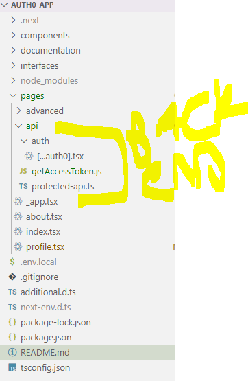
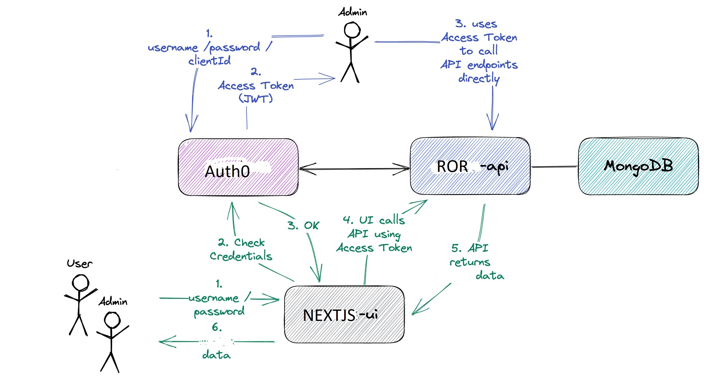

# AuthO-SchoolHeadOffice
The goal of this project is to secure `SchoolHeadOffice.co.za` using [`Auth0`](https://auth0.com//)(with PKCE). 

## Authorization Code Flow with Proof Key for Code Exchange (PKCE)
- Public clients (native and SPA): Cannot securely store a Client Secret due to app decompilation or browser access.
- Native apps: Use custom URL schemes (e.g., MyApp://), posing risks of malicious app interception.
- Single-page apps: Expose source code, making Client Secrets insecure.
- Solution: OAuth 2.0 offers PKCE-enhanced Authorization Code Flow for better security.
# PKCE DIAGRAM

- The user clicks Login within the application.

- Auth0's SDK creates a cryptographically-random code_verifier and from this generates a code_challenge.

- Auth0's SDK redirects the user to the Auth0 Authorization Server (/authorizeendpoint) along with the code_challenge.

- our Auth0 Authorization Server redirects the user to the login and authorization prompt.

- The user authenticates using one of the configured login options and may see a consent page listing the permissions Auth0 will give to the application.

- our Auth0 Authorization Server stores the code_challenge and redirects the user back to the application with an authorization code, which is good for one use.

- Auth0's SDK sends this code and the code_verifier (created in step 2) to the Auth0 Authorization Server (/oauth/tokenendpoint).

- our Auth0 Authorization Server verifies the code_challenge and code_verifier.

- our Auth0 Authorization Server responds with an ID token and access token (and optionally, a refresh token).

- our application uses the access token to call an API to access information about the user.
  
our application structure is like this
  we  use the 
pages/api Folder for backend API routes (getAccessToken.js, protected-api.ts). 
Sub-folder auth for dynamic route [...auth].tsx.


```console
├── components/
│         ├── adminPage/
│         │           ├── AccountManagementSection/
│         │           ├── Accounttypesettings/
│         │           ├── communicationsection/
│         │           ├── eventsandtripsSection/
│         │           ├── mealsandcateringSection/
│         │           ├── paymentsection/
│         │           ├── reportingandanalyticsSection/
│         │           ├── services/
│         │           ├── sidebar/
│         │           ├── supportandsettingsection/
│         │           ├── utils/
│         │           ├── AccountTypeSettings.js
│         │           ├── AdiminSearchPage.js         
|         │           ├── AdminSearchPage.js
|                     ├── AdminSettings.js
|                     ├── DeleteAccountSettings.js
                  │   ├── gradesManagement/
              │   │      ├── GradesContainer.js  #Main container component
              │   │      ├── GradesCRUD/
│   │   │                     ├── CreateGradeModal.js  # Create new grade modal
│   │   │                     ├── EditGradeModal.js  #Edit existing grade modal
│   │   │                     └── DeleteGradeModal.js  # Delete grade modal
│   │                    ├── LearnersManager/
│   │             │           ├── LearnersTable.js  # Learners table pagination
│   │   │                     ├── LearnersFilters.js # Advanced filtering
│   │   │                ├── BulkUpload.js # Bulk learner upload 
│   │   │                └── LearnerDetail.js  # Individual learner modal
│   │                    ├── Invitations/
│   │   │                     ├── TemplateManager.js # Email template 
│   │   │                     ├── InvitationComposer.js # send invitations
│   │   │                     ├── StatusTracker.js # Track invitation delivery 
│   │   │                     └── CreditSystem.js # Manage invitation credits
│   │                    └── sidebar/
│   │                         └── GradesNavigation.js  # Navigation component 
|                    ├── LinkedAccountsSettings.js
|                    ├── PasswordSettings.js
|                    ├── PaymentRequests.js
|                    ├── Payouts.js
|                    ├── PreferencesSettings.js
|                    ├── ProfileSettings.js
├                    |── Reports.js
|                    ├── SchoolDetails.js
|                    ├── SchoolManagementPage.js
|                    ├── Settings.js
|                    ├── SettingsLayout.js
|                    ├── Sidebar.js
|                    ├── Transactions.js
│         ├── common/
│         ├── context/
│         ├── customers/
│         ├── data/
│         ├── fileupload/
│         ├── footer/
│         ├── frontpagecomponents/
│         ├── hooks/
│         ├── layouts/
│         ├── redux/
│         ├── schoolpage/
│         ├── spinners/
├── documentation/
├── interfaces/
├── node_modules/
├── pages/
│   ├── advanced/
│   ├── api/
│   │   ├── auth/
│   │   │   └── [...auth].tsx
│   │   ├── getAccessToken.js
│   │   └── protected-api.ts
│   ├── _app.tsx
│   ├── about.tsx
│   ├── index.tsx
│   └── profile.tsx
├── .env.local
├── .gitignore
├── additional.d.ts
├── next-env.d.ts
├── package-lock.json
├── package.json
├── README.md
└── tsconfig.json\
```

 

- The API responds with requested data.
-
## getting user from database and saving to database 
```markdown
// Step 1: User logs in -> Retrieve user token
USER_LOGIN
  |
  v
GET_TOKEN_FROM_AUTH0
  |
  v
TOKEN = "Bearer <user_access_token>"

// Step 2: Check if the user exists in MongoDB via RoR API
PROFILE_PAGE_LOAD
  |
  v
CALL_ROR_API(/[api/v1/users](http://localhost:4000/api/v1/users))
  |
  v
IF (USER_EXISTS_IN_MONGODB)
  |-------------------------YES---------------------------> USER_CAN_ACCESS_APP
  |
  v
  NO
  |
  v
// Step 3: User does not exist -> Create the user in MongoDB
FETCH_USER_DETAILS_FROM_AUTH0
  |
  v
CREATE_USER_PAYLOAD = {
  "name": "<user_name>",
  "email": "<user_email>",
  "roles": ["default_role"]  // Add default role
}
  |
  v
CALL_ROR_API(/api/userextras/me, POST, CREATE_USER_PAYLOAD)
  |
  v
SAVE_USER_TO_MONGODB
  |
  v
USER_CAN_ACCESS_APP

// Functions and relationships
getUserExtrasMe(token) -> Call GET [/api/v1/users](http://localhost:4000/api/v1/users)
  |
  v
  Response: 
    -> 200 OK -> User exists
    -> 404 NOT FOUND -> User does not exist, proceed to save user

saveUserExtrasMe(token, userExtra) -> Call POST /api/v1/users
  |
  v
  Request Payload: userExtra = { name, email, roles }
  |
  v
  MongoDB.save(userExtra)

// Process hierarchy and flow diagram
┌───────────────────────────────────────┐
│             User Logs In              │
└───────────────────────────────────────┘
                  |
                  v
┌───────────────────────────────────────┐
│      GET /api/v1/users           │
│      (Check if user exists)           │
└───────────────────────────────────────┘
        |                 |
        v                 v
┌────────────────┐    ┌───────────────────┐
│ User Exists    │    │ User Does Not Exist│
│ -> 200 OK      │    │ -> 404 NOT FOUND   │
└────────────────┘    └───────────────────┘
                           |
                           v
┌──────────────────────────────────────────────┐
│  Fetch User Info from Auth0, Create Payload  │
│  POST /api/v1/users (Save to MongoDB)   │
└──────────────────────────────────────────────┘
                           |
                           v
┌───────────────────────────────────────┐
│         User Can Access App           │
└───────────────────────────────────────┘
```
this is how we ll send a u ser to mongodb and get a user 

-   
# Plan Outline
1. Authentication (Auth0 Integration)
-Login Flow:
- Users log in via Auth0.
- On successful login, retrieve user details (sub, email, name) from Auth0.
- Check if the user exists in MongoDB.
If the user does not exist, create a new user entry.
- Store user session details in a secure cookie or session store.

#  User Settings Overview
- Features:
 1. Update Profile Details:
- Name
- Email
- Profile Picture
2. Change Password:
- Ensure secure password update flow.
3. Preferences:
- Notifications (e.g., email notifications for updates).
- Language and regional settings.
4. Linked Accounts:
- Manage connected accounts (e.g., linking/unlinking third-party providers like Google, Facebook).
5. Account Deletion:
- Option for the user to delete their account with a warning about data loss.

```markdown
+-----------+         +-------------------+         +------------------+
|   User    | ----->  |  Frontend (Next)  | ----->  |   Backend (RoR)  |
+-----------+         +-------------------+         +------------------+
       |                        |                            |
       | Update Profile/Prefs   | Update via API             |
       |----------------------->|--------------------------->|
       |                        |                            |
       |       Response         |         Save to DB         |
       |<-----------------------|<---------------------------|


```
# API
```markdown
4. API Endpoints
Endpoint	Method	Description
/api/users/profile	PUT	Update profile details
/api/users/password	PUT	Change password
/api/preferences	PUT	Update user preferences
/api/users/delete	DELETE	Delete user account

```
You can follow these tutorials to use Auth0 API endpoints to Add Login Using the Authorization Code Flow with  [https://auth0.com/docs/get-started/authentication-and-authorization-flow/authorization-code-flow-with-pkce/add-login-using-the-authorization-code-flow-with-pkce] or Call Your API Using the Authorization Code Flow with PKCE [https://auth0.com/docs/get-started/authentication-and-authorization-flow/authorization-code-flow-with-pkce/call-your-api-using-the-authorization-code-flow-with-pkce].
for Backend rails app [Autho0 officle example used here](https://auth0.com/docs/quickstart/backend/rails)

## TODO

-sEND TOKEN WITH ROLES OR HAVING THE ROLES  IN BACKEND 
CHECKED BY rOR APP 
SOME LIKE THIS 
```ruby
# app/lib/auth0_client.rb

# frozen_string_literal: true

require 'jwt'
require 'net/http'

class Auth0Client 

  # Auth0 Client Objects 
  Error = Struct.new(:message, :status)
  Response = Struct.new(:decoded_token, :error)

  Token = Struct.new(:token) do
    def validate_permissions(permissions)
      required_permissions = Set.new permissions
      scopes = token[0]['scope']
      token_permissions = scopes.present? ? Set.new(scopes.split(" ")) : Set.new
      required_permissions <= token_permissions
    end
  end
  
  def self.validate_token(token)
    jwks_response = get_jwks

    unless jwks_response.is_a? Net::HTTPSuccess
      error = Error.new(message: 'Unable to verify credentials', status: :internal_server_error)
      return Response.new(nil, error)
    end

    jwks_hash = JSON.parse(jwks_response.body).deep_symbolize_keys

    decoded_token = decode_token(token, jwks_hash)

    Response.new(Token.new(decoded_token), nil)
  rescue JWT::VerificationError, JWT::DecodeError => e
    error = Error.new('Bad credentials', :unauthorized)
    Response.new(nil, error)
  end
end

# write code to update user  roles upn login
have admin teachers SGB MEMBERS ,dONORS 
 
```
## Applications

- ### RoR-api

  `Ruby on Rails =>7 ` Web backend application that exposes a REST API to manage *Schools**. Its secured endpoints can just be accessed if an access token (JWT) issued by `Auth0` is provided.
  
  `RoR-api` stores its data in a [`Mongo`](https://www.mongodb.com/) database.

  `RoR-api` has the following endpoints

  | Endpoint                                                          | Secured | Roles                       |
  |-------------------------------------------------------------------|---------|-----------------------------|
  | `GET /api/v1/users/${userId}`                                          | Yes     | `SCHOOLS_MANAGER` and `USER` |
  | `POST /api/v1/users/${userId}`                             | Yes     | `SCHOOLS_MANAGER` and `USER` | 
  | `GET /api/schools`                                                 | | Endpoint                         | HTTP Method | Secured | Roles                     |
|----------------------------------|-------------|---------|---------------------------|
| `GET /getschoolswithoutuserid`   | GET         | Yes     | `USER`                    |
| `GET /newsletters`               | GET         | Yes     | `USER` and `EDITOR`       |
| `GET /schools`                   | GET         | Yes     | `ADMIN` and `USER`        |
| `POST /AlreadySavedSchools`      | POST        | Yes     | `USER`                    |
| `POST /checkImpression`          | POST        | Yes     | `USER`                    |
| `POST /checkResourceImpression`  | POST        | Yes     | `USER`                    |
| `POST /conversations`            | POST        | Yes     | `USER` and `MODERATOR`    |
| `POST /createclass`              | POST        | Yes     | `TEACHER` and `ADMIN`     |
| `POST /createContact`            | POST        | Yes     | `USER`                    |
| `POST /createevent`              | POST        | Yes     | `ADMIN`                   |
| `POST /createfolder`             | POST        | Yes     | `EDITOR` and `USER`       |


- ### nextjs-ui

  `NextJS` frontend application where `users` can see and comment schools and `admins` can manage schools. In order to access the application, `user` / `admin` must login using his/her username and password. Those credentials are handled by `Auth0`. All the requests coming from `schools-ui` to secured endpoints in `schools-api` have a access token (JWT) that is generated when `user` / `admin` logs in.
  
  `nextjs-ui` uses tailwind as CSS-styled framework.

## Testing movies-api endpoints

You can manage movies by accessing directly `RoR-api` endpoints using the Swagger website or `curl`. However, for the secured endpoints like `POST /api/schools`, `PUT /api/school/{id}`, `DELETE /api/school/{id}`, etc, you need to inform an access token issued by `Auth0`.

## Getting the Access Token

- Set Up Your Application in Auth0:
- Create an application in the Auth0 dashboard and note down the Client ID and Client Secret.
- Ensure you have an API set up in Auth0 with an identifier (audience) that your application will use to request tokens.
- Make a POST Request to the Token Endpoint:
- To request an access token, perform a POST request to the Auth0 token endpoint:text
POST https://{yourDomain}/oauth/token

- Replace {yourDomain} with your Auth0 domain (e.g., your-tenant.auth0.com).
- Prepare the Request Payload:
- The payload should include the following parameters:
grant_type: Set this to client_credentials.
client_id: Your application's Client ID.
client_secret: Your application's Client Secret.
audience: The API identifier you configured in Auth0.

 Open a terminal

- Run the following commands to get the access token

Here's how the payload looks in a cURL command:
bash
curl --request POST \
  --url 'https://{yourDomain}/oauth/token' \
  --header 'content-type: application/x-www-form-urlencoded' \
  --data 'grant_type=client_credentials' \
  --data 'client_id={yourClientId}' \
  --data 'client_secret={yourClientSecret}' \
  --data 'audience=https://{yourDomain}/api/v2/'

Receive the Access Token:
Upon successful authentication, you will receive a response containing the access token, which looks like this:
json
{
  "access_token": "eyJz93a...k4laUWw",
  "token_type": "Bearer",
  "expires_in": 86400
}

The access_token can now be used to authenticate requests to your API.
## How we plan to use it 

This example shows how you can use `@auth0/nextjs-auth` to easily add authentication support to your Next.js application. It tries to cover a few topics:

- Signing in
- Signing out
- Loading the user on the server side and adding it as part of SSR ([`pages/advanced/ssr-profile.tsx`](pages/advanced/ssr-profile.tsx))
- Loading the user on the client side and using fast/cached SSR pages ([`pages/index.tsx`](pages/index.tsx))
- Loading the user on the client side and checking authentication CSR pages ([`pages/profile.tsx`](pages/profile.tsx))
- Loading the user on the client side by accessing API (Serverless function) CSR pages ([`pages/advanced/api-profile.tsx`](pages/advanced/api-profile.tsx))
- Creates route handlers under the hood that perform different parts of the authentication flow ([`pages/auth/[...auth0].tsx`](pages/auth/[...auth0].tsx))

Read more: [https://auth0.com/blog/ultimate-guide-nextjs-authentication-auth0/](https://auth0.com/blog/ultimate-guide-nextjs-authentication-auth0/)

## Project diagram




## How to use

First, run the development server:

```bash
npm run dev
# or
yarn dev
# or
pnpm dev
# or
bun dev
```

## Configuring Auth0

1. Go to the [Auth0 dashboard](https://manage.auth0.com/) and create a new application of type _Regular Web Applications_ and make sure to configure the following
2. Go to the settings page of the application
3. Configure the following settings:

- _Allowed Callback URLs_: Should be set to `http://localhost:3000/api/auth/callback` when testing locally or typically to `https://myapp.com/api/auth/callback` when deploying your application.
- _Allowed Logout URLs_: Should be set to `http://localhost:3000/` when testing locally or typically to `https://myapp.com/` when deploying your application.

4. Save the settings

### Set up environment variables

To connect the app with Auth0, you'll need to add the settings from your Auth0 application as environment variables

Copy the `.env.local.example` file in this directory to `.env.local` (which will be ignored by Git):

```bash
cp .env.local.example .env.local
```

Then, open `.env.local` and add the missing environment variables:

- `AUTH0_ISSUER_BASE_URL` - Can be found in the Auth0 dashboard under `settings`. (Should be prefixed with `https://`)
- `AUTH0_CLIENT_ID` - Can be found in the Auth0 dashboard under `settings`.
- `AUTH0_CLIENT_SECRET` - Can be found in the Auth0 dashboard under `settings`.
- `AUTH0_BASE_URL` - The base url of the application.
- `AUTH0_SECRET` - Has to be at least 32 characters. You can use [this generator](https://generate-secret.vercel.app/32) to generate a value.

## Deploy on Vercel

You can deploy this app to the cloud with [Vercel](https://vercel.com?utm_source=github&utm_medium=readme&utm_campaign=next-example) ([Documentation](https://nextjs.org/docs/deployment)).

### Deploy Your Local Project

To deploy your local project to Vercel, push it to GitHub/GitLab/Bitbucket and [import to Vercel](https://vercel.com/new?utm_source=github&utm_medium=readme&utm_campaign=next-example).

**Important**: When you import your project on Vercel, make sure to click on **Environment Variables** and set them to match your `.env.local` file.
## addtional website 
[https://auth0.com/blog/ultimate-guide-nextjs-authentication-auth0/#Next-js-Static-Site-Approach]
