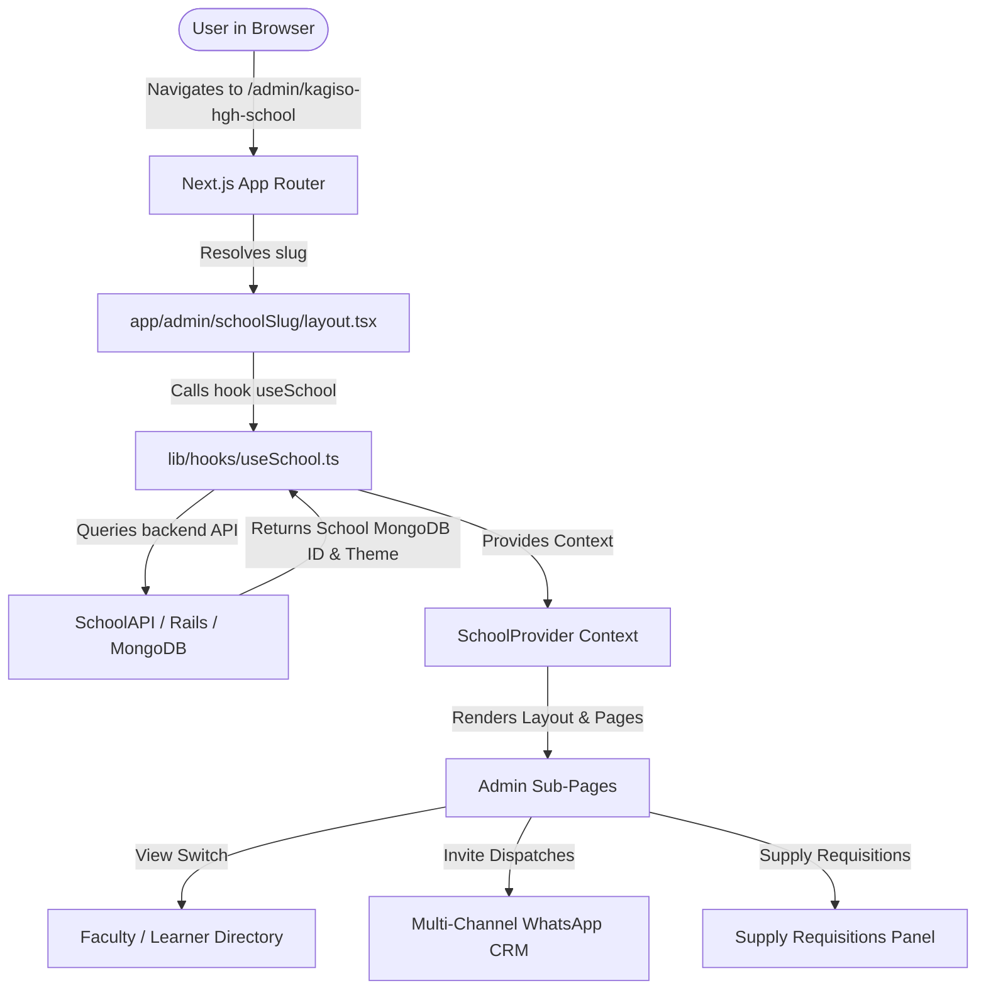
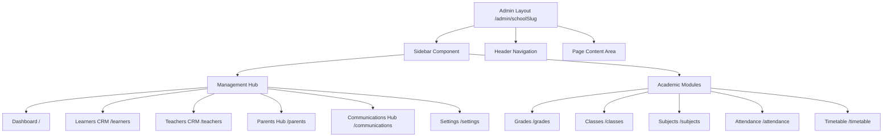

# 🏫 SchoolHeadOffice Admin System Architecture & Guide

Welcome to the beginner-friendly guide for the **SchoolHeadOffice Admin System**! This document explains how the administrative dashboard at `http://localhost:3000/admin/kagiso-hgh-school` works, how folders and files are structured, how navigation and layouts operate, and how logic flows between frontend components and backend APIs.

---

## 📌 1. High-Level Page Overview

When you open `http://localhost:3000/admin/kagiso-hgh-school` in your web browser:

1. **`kagiso-hgh-school`** is the dynamic **`schoolSlug`** parameter.
2. The page loads the **`AdminDashboardLayout`** (`app/admin/[schoolSlug]/layout.tsx`), which renders:
   - **Collapsible Sidebar**: Contains links to **Management Hub** and **Academic Modules**.
   - **Top Navigation Bar**: Contains Breadcrumbs, Global Search, Academic Year Selector, and User Profile.
   - **Main Content Viewport**: Loads specific page views dynamically based on the current URL path.

---

## 🗺️ 2. System Architecture & Flow Diagrams

### 💡 Overall Request & Data Flow


---

### 🗂️ Navigation & Sidebar Layout Map


---

## 📁 3. Beginner Breakdown: Next.js App Router Folder Structure

In modern Next.js (App Router), **folders define URL routes**, and specific file names have predefined roles:

* **`layout.tsx`**: Wraps surrounding pages with common UI (like Sidebars and Headers) that stay visible across navigation without reloading the entire page.
* **`page.tsx`**: Represents the actual unique content loaded for a specific URL.
* **`loading.tsx`**: Displays fallback skeleton UI while data is loading.

### 🌳 Directory Structure for Admin Module:

```text
app/
 └── admin/
      └── [schoolSlug]/                 <-- Dynamic Route (e.g. kagiso-hgh-school)
           ├── layout.tsx              <-- Admin Shell (Sidebar, Header, Theme Provider)
           ├── page.tsx                <-- Main Admin Dashboard Overview
           ├── loading.tsx             <-- Dashboard Loading Skeleton
           │
           ├── learners/
           │    └── page.tsx           <-- Learner Directory & Parent Invitations CRM
           │
           ├── teachers/
           │    └── page.tsx           <-- Teacher Management & Supply Requisitions
           │
           ├── communications/
           │    └── page.tsx           <-- Communications Hub (Messaging & ActionCable)
           │
           ├── grades/
           │    └── page.tsx           <-- Grades & Academic Levels Overview
           │
           ├── classes/
           │    └── page.tsx           <-- Class Allocation & Utilization Progress
           │
           ├── subjects/
           │    └── page.tsx           <-- Subject Management & Teacher Assignments
           │
           ├── attendance/
           │    └── page.tsx           <-- Attendance Register & Absence Tracking
           │
           └── settings/
                └── page.tsx           <-- School Preferences & Theme Configuration
```

---

## 🔍 4. In-Depth Breakdown of Key Extended Pages

### 🧑‍🏫 A. Teachers CRM & Supply Requisitions (`/admin/[schoolSlug]/teachers`)
* **Faculty Directory Tab**: Displays faculty cards, departments, assigned grades, student count, and average result performance.
* **Teacher Invitations CRM Tab**:
  * **Single & Bulk Invite Wizard**: Allows inviting staff or community teachers with assigned grades and subjects via WhatsApp.
  * **WhatsApp Business Pipeline**: Dispatches dynamic magic link invitations using `/api/whatsapp-business/send-bulk`.
  * **Invitations Table**: Offers real-time actions for `Accept & Link`, `Resend`, and `Cancel`.
* **Supply Requisitions Tab**:
  * **School-wide Triage**: Lists all paper and material requests across faculty members.
  * **Status Actions**: Approve, Reject (with optional admin notes), or Mark Fulfilled.
* **Teacher Profile Slide-Over (`TeacherProfileDrawer`)**:
  * Displays teacher employment details, qualifications, and an embedded **Supply Requests** tab for logging paper/supply requisitions on behalf of teachers.

---

### 🎒 B. Learners CRM & Parent Invitations (`/admin/[schoolSlug]/learners`)
* **Learner Directory Tab**: Supports Table and Grid layouts, pagination, search, and grade filtering.
* **Invitations CRM Tab**: Multi-channel (WhatsApp/SMS/Email) parent portal invite wizard with real-time student autocomplete search.
* **Parent Access Requests**: Approval/Rejection workflow for incoming parent portal sign-up requests.
* **Management Hub Tab**: Bulk Excel Import and Learner Promotion transitions across academic years.
* **Academic Modules Tab**: Attendance tracking, Subject allocation, Timetable management, and Academic Report card generation.

---

### 💬 C. Communications Hub (`/admin/[schoolSlug]/communications`)
* **Real-time Messaging**: Real-time Action Cable WebSockets integration for conversations between school admins, teachers, and parents.
* **Note to Self**: Private administrator notebook conversation.
* **Broadcast Announcements**: School-wide broadcast messaging features.

---

## ⚡ 5. Summary Cheat Sheet for Beginners

| Concept | Explanation | Example File |
| :--- | :--- | :--- |
| **Dynamic Route Parameter** | `[schoolSlug]` in brackets means Next.js captures whatever is in that URL position. | `kagiso-hgh-school` |
| **Layout Component** | Persistent UI frame containing sidebar & header wrapper around pages. | `app/admin/[schoolSlug]/layout.tsx` |
| **Page Component** | The actual view content rendered in the center viewport. | `app/admin/[schoolSlug]/teachers/page.tsx` |
| **API Client Abstraction** | Unified service class handling backend HTTP requests and Zod schema validations. | `lib/api/school-api.ts` |
