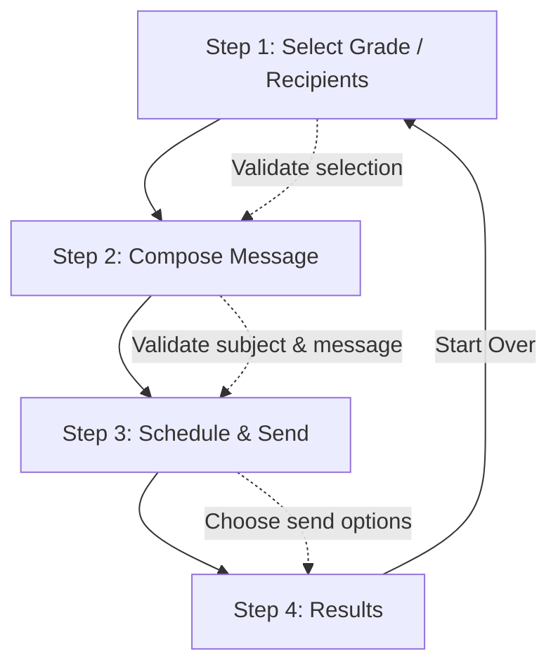

## InvitationComposer Overview

The **InvitationComposer** is a React component that provides a **step-by-step wizard** for creating, scheduling, and sending invitations to school recipients (students/parents). It integrates grade selection, message composition, scheduling, sending, and previewing results into a single streamlined flow.

---

### Features

* **Multi-step Wizard Flow**

  1. **Select Grade / Recipients** → Pick recipients or a whole grade.
  2. **Compose Message** → Write subject, body, and select a template if needed.
  3. **Schedule & Send** → Choose immediate send or schedule for later.
  4. **Results** → Review sending results.

* **Validation** → Ensures subject, message, and recipients/grades are provided.

* **Data Fetching** → Loads school grades from an API using an auth token.

* **Sending Modes** → Supports single send and bulk send.

* **Extra Tools** →

  * **VideoRecordingStudio** for recording and attaching videos.
  * **WhatsAppMessageTester** for testing message templates.

---

### Stepper Flow (Mermaid Diagram)

---

### Components Involved

* **RecipientSelector** → For choosing recipients or grades.
* **MessageEditor** → For writing the invitation content.
* **SchedulingOptions** → For choosing send time (immediate or scheduled).
* **PreviewPanel** → Displays results of sending.
* **SendingControls** → Footer actions (send/reset).
* **VideoRecordingStudio** → Video recording modal.
* **WhatsAppMessageTester** → Template manager modal.

---

### Error Handling

* Shows validation errors per field (recipients, subject, message).
* Displays general errors (e.g., API failures).

---

### Technologies

* **React + Hooks** (`useState`, `useEffect`).
* **axios** for API requests.
* **lucide-react** for icons.
* **TailwindCSS** for styling.

---

✅ In short, **InvitationComposer** acts as a guided workflow for school admins to efficiently send customized invitations, with built-in validation, templates, scheduling, and results tracking.
