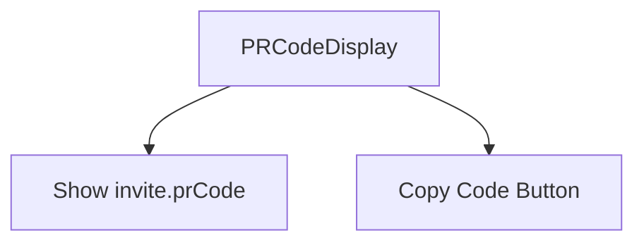
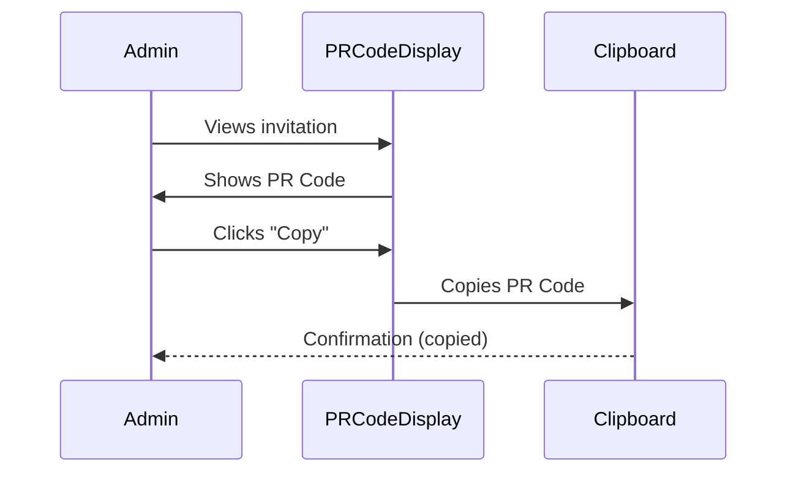

📌 Summary of PRCodeDisplay

Purpose:
Displays the personal referral (PR) code in a clean, readable format.

Main Features (based on context and naming):

Shows the generated PR code (invite.prCode).

Provides copy-to-clipboard functionality (similar to InviteLinkManager).

Uses a monospace font for clarity (good for codes).

Simple UI component focused only on the PR code (no analytics or expiration info).