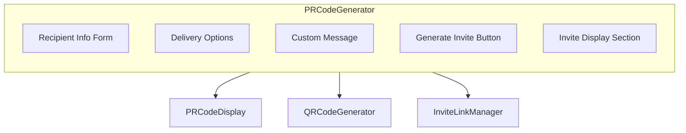

```mermaid

flowchart TD
    A[Admin fills form] --> B[Select recipient type, name, email, phone]
    B --> C[Choose delivery channels (WhatsApp, SMS, Email)]
    C --> D[Optional: Add custom message]
    D --> E[Click Generate Invitation]
    E --> F[Generate PR Code (SCHOOL-TYPE-RANDOM)]
    F --> G[POST /api/invites with invite details]
    G -->|Success| H[Save generated invite in state]
    H --> I[Show components: PRCodeDisplay, QRCodeGenerator, InviteLinkManager]
    G -->|Failure| J[Show error alert]

```

A React component that allows schools to generate and send personalized invitations (via WhatsApp, SMS, or Email) to learners, teachers, or parents.

🔑 Key Features

Recipient Information

Collects recipient type (learner, teacher, parent), name, email, and phone.

Ensures at least one contact method (email or phone) is provided.

Delivery Options

Choose delivery channels (whatsapp, sms, email) with WhatsApp marked as recommended.

Add a custom message (optional).

Invitation Code Generation

Creates a unique PR code in the format:
SCHOOLINITIALS-TYPECODE-RANDOM

Example: ABC-L-1A2B3C

Invite Creation

Sends data to /api/invites via POST request.

Stores created invite in local state and calls an optional onInviteCreated callback.

Loading State & Error Handling

Shows loading text while invite is being generated.

Alerts the user if invite creation fails.

Invite Display

Once generated, shows:

PRCodeDisplay → displays the invite code.

QRCodeGenerator → generates a QR code.

InviteLinkManager → provides links and management options.

🛠️ Dependencies

React hooks (useState, useEffect)

React Icons (FiCopy, FiDownload, FiQrCode, FiLink, FiUsers)

Custom Components:
PRCodeDisplay, QRCodeGenerator, InviteLinkManager