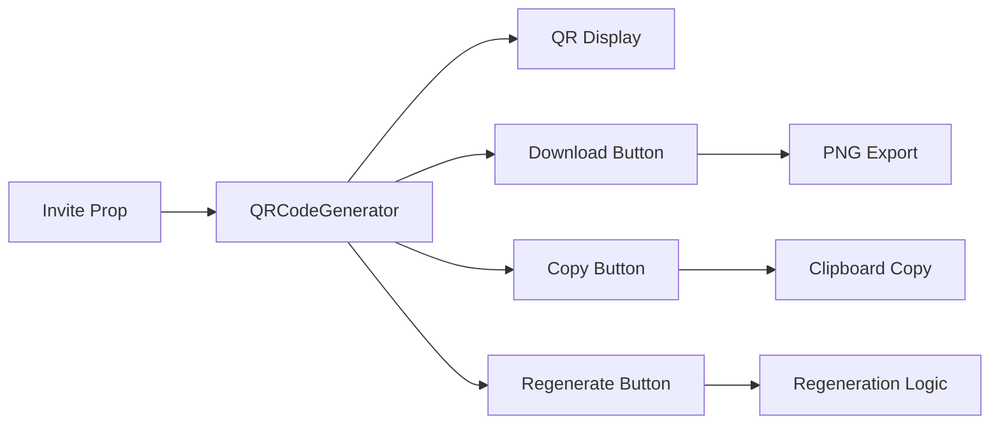

📋 Component Summary
QRCodeGenerator is a React component that creates and manages QR codes for school invitation links.

🎯 Core Functionality:
QR Code Display: Shows a visual representation of invitation codes

Download Capability: Exports QR code as PNG image

Copy to Clipboard: Copies QR code image for easy sharing

Regeneration: Option to create new QR codes (placeholder implementation)

🔧 Technical Features:
Uses html-to-image library for image conversion

Responsive design with Tailwind CSS

Loading states for better UX

Error handling for browser compatibility

📊 Data Flow:


🎨 UI Structure:
```mermaid
graph TB
    subgraph QRCodeGenerator
        A[Header]
        B[QR Display Area]
        C[Action Buttons]
        D[Usage Guidelines]
        E[Link Preview]
    end
    
    B --> F[QR Placeholder]
    B --> G[School Info]
    
    C --> H[Download]
    C --> I[Copy]
    C --> J[Regenerate]
    
    style A fill:#e1f5fe
    style C fill:#f3e5f5
    style D fill:#f1f8e9

    ```

    ⚙️ Props:
invite: Object containing:

prCode: Personal referral code

schoolId.name: School name

shortUrl: Shortened invitation URL

🚀 Methods:
downloadQRCode(): Converts HTML to PNG and triggers download

copyQRCode(): Copies QR image to clipboard

regenerateQRCode(): Placeholder for regeneration logic

🎨 Visual Design:
Clean, card-based layout

Consistent color scheme (blue primary, gray secondary)

Responsive grid system

Loading states and disabled buttons during processing

🔒 Browser Compatibility:
Requires modern browser features (Clipboard API, async/await)

Includes fallbacks and error handling

Progressive enhancement approach

This component provides an intuitive interface for managing QR code invitations with professional styling and robust functionality.