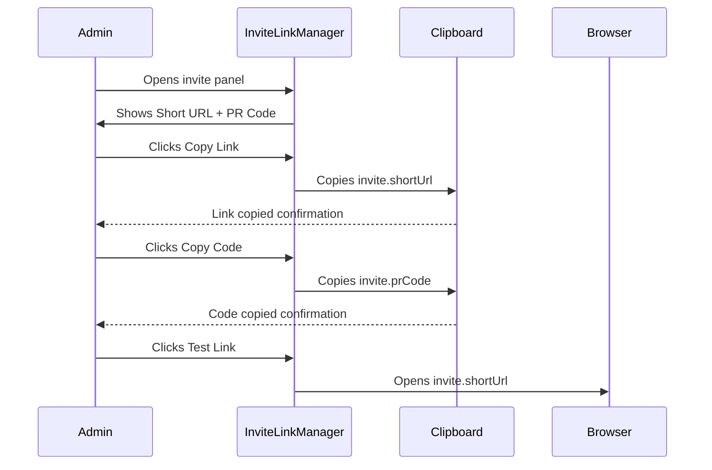

```mermaid
flowchart TD
    A[InviteLinkManager] --> B[Copy/Share Section]
    A --> C[PR Code Display]
    A --> D[Action Buttons]
    A --> E[Status Information]
    A --> F[Best Practices Tips]

    B --> B1[Copy Short URL]
    B --> B2[Copy to Clipboard]
    
    C --> C1[Copy PR Code]
    
    D --> D1[Test Link (open in new tab)]
    D --> D2[Analytics Placeholder]

    E --> E1[Status: sent/accepted/expired]
    E --> E2[Expiration (days left)]
    E --> E3[Views + Last Viewed]

    F --> F1[Share link digitally]
    F --> F2[Use QR for print]
    F --> F3[PR Code for verbal]
    F --> F4[Analytics dashboard]
```



📌 Summary of InviteLinkManager

This component provides a management panel for an invitation link.

🔑 Key Features

Copy & Share

Copy short link (invite.shortUrl) to clipboard.

Copy referral code (invite.prCode) to clipboard.

Open the invite link in a new tab.

Expiration Status

Calculates days left until expiration.

Shows Expired (red), Warning if ≤ 7 days (amber), or Valid (green).

Status Information

Displays invitation status (sent, accepted, expired).

Shows expiration date, view count, and last viewed date.

Analytics & Future Enhancements

"Analytics" button (placeholder).

Keeps space for tracking engagement.

Best Practices Panel

Suggests when to use link, QR code, PR code.