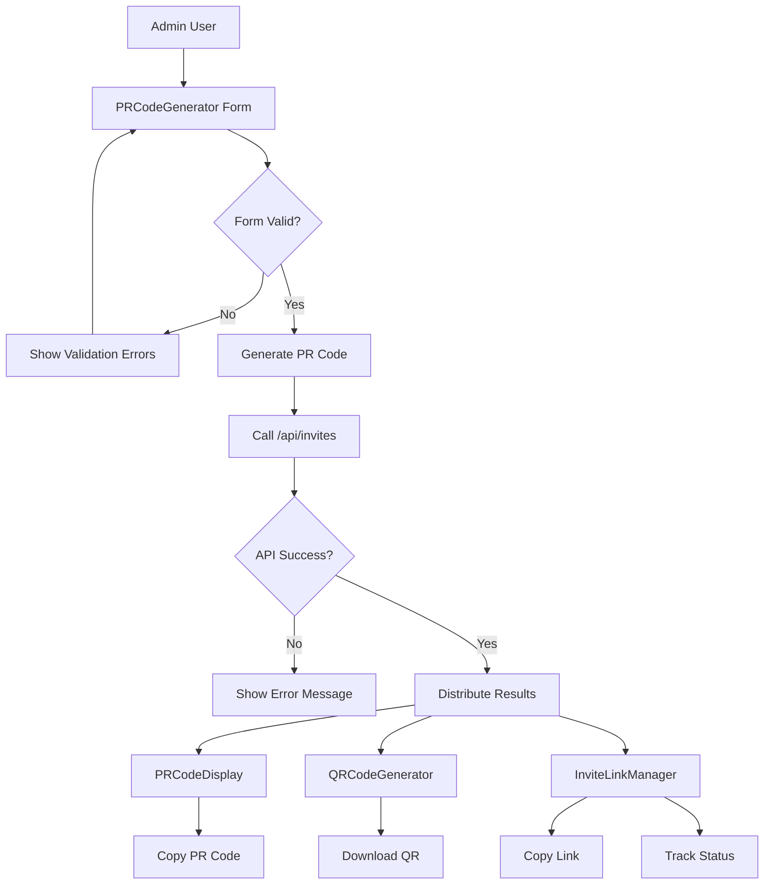
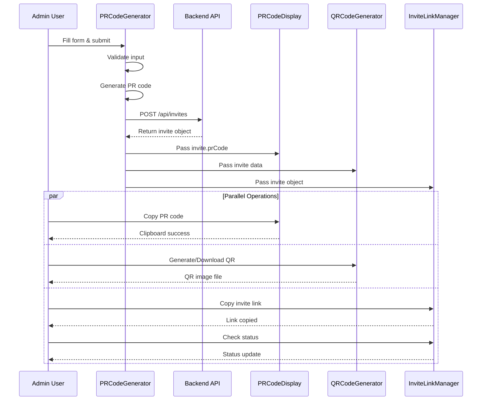
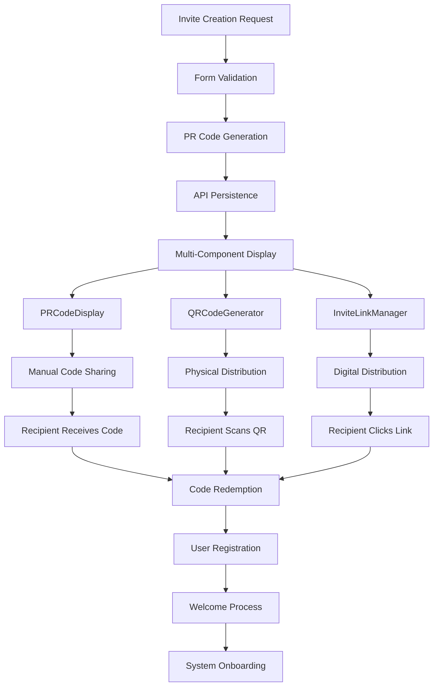

# School Invite System - Complete Overview

## 🎯 Purpose & Vision

The School Invite System is a comprehensive solution designed to streamline how educational institutions **create, manage, and track invitations** for learners, parents, and teachers. It provides multiple delivery channels and flexible sharing options to maximize reach and engagement.

## 🏗️ System Architecture

### Component Hierarchy
```
School Invite System
├── PRCodeGenerator (Parent Component)
│   ├── PRCodeDisplay (Child)
│   ├── QRCodeGenerator (Child) 
│   └── InviteLinkManager (Child)
└── Backend API (/api/invites)
```

## 📋 Component Responsibilities

### 1. PRCodeGenerator (Main Controller)
**Role**: Primary invite creation interface and orchestrator

**Key Features**:
- Comprehensive invite creation form
- Recipient type selection (Learner, Parent, Teacher)
- Multi-channel delivery options (WhatsApp, SMS, Email)
- Unique PR code generation (`SCHOOL-TYPE-RANDOM` format)
- Custom message personalization
- API integration for invite persistence
- Child component coordination

**Data Flow**: Input → Validation → API Call → Results Distribution

### 2. PRCodeDisplay (Code Presenter)
**Role**: Referral code display and interaction

**Key Features**:
- Clear PR code presentation
- One-click copy-to-clipboard functionality
- Visual feedback for copy actions
- Formatted code display with branding

**Use Cases**: Manual code sharing, phone conversations, printed materials

### 3. QRCodeGenerator (Visual Sharing)
**Role**: QR code generation and management

**Key Features**:
- Dynamic QR code generation from invite data
- Downloadable QR images
- Customizable QR styling
- Error correction levels
- Print-ready formats

**Use Cases**: Posters, flyers, physical handouts, contactless sharing

### 4. InviteLinkManager (Digital Hub)
**Role**: Link management and analytics center

**Key Features**:
- Short URL generation and management
- Link copying and sharing utilities
- Real-time invite status tracking
- Expiration date monitoring
- View analytics and timestamps
- Best practice sharing guidance
- Multi-platform sharing options

**Use Cases**: Digital distribution, social sharing, email campaigns, analytics

## 🔄 System Flows

### 1. Component Interaction Flow


### 2. Data Flow Sequence


### 3. Complete Invite Lifecycle


## 📊 Data Structure

### Invite Object Schema
```json
{
  "id": "uuid",
  "prCode": "SCHOOL-LEARNER-ABC123",
  "recipientType": "learner|parent|teacher",
  "recipientName": "string",
  "recipientEmail": "string",
  "recipientPhone": "string",
  "inviteLink": "https://short.ly/abc123",
  "qrCodeData": "string",
  "channels": ["whatsapp", "sms", "email"],
  "customMessage": "string",
  "status": "pending|sent|viewed|accepted|expired",
  "createdAt": "timestamp",
  "expiresAt": "timestamp",
  "viewCount": "number",
  "lastViewedAt": "timestamp",
  "metadata": {
    "schoolId": "string",
    "createdBy": "string",
    "campaign": "string"
  }
}
```

## 🔧 Technical Implementation

### Technology Stack
- **Frontend**: React with TypeScript
- **Styling**: Tailwind CSS
- **Icons**: Lucide React
- **QR Generation**: qrcode library
- **Clipboard**: Navigator Clipboard API
- **State Management**: React useState/useEffect

### API Endpoints
```
POST /api/invites
├── Create new invite
├── Generate PR code
├── Create short link
└── Return invite object

GET /api/invites/:id
├── Fetch invite details
├── Update view count
└── Return current status

PUT /api/invites/:id
├── Update invite status
├── Modify expiration
└── Add analytics data
```

## 🎨 User Experience Flow

### Admin Journey
1. **Access**: Open invite creation interface
2. **Configure**: Select recipient type and enter details
3. **Customize**: Choose delivery channels and add message
4. **Generate**: Create invite with PR code, link, and QR
5. **Share**: Use multiple sharing options simultaneously
6. **Track**: Monitor invite status and engagement

### Recipient Journey
1. **Receive**: Get invite via chosen channel(s)
2. **Access**: Use PR code, scan QR, or click link
3. **Validate**: System verifies invite authenticity
4. **Register**: Complete onboarding process
5. **Welcome**: Access school platform

## 📈 Analytics & Tracking

### Metrics Captured
- Invite creation rate
- Channel performance (WhatsApp vs SMS vs Email)
- QR code scan rates
- Link click-through rates
- Conversion rates (invite → registration)
- Time-to-conversion
- Geographic distribution
- Device/platform analytics

### Reporting Dashboard
- Real-time invite status
- Channel effectiveness
- Conversion funnels
- Expiration alerts
- Performance trends
- ROI calculations

## 🚀 Benefits & Use Cases

### For Schools
- **Streamlined Onboarding**: Reduce manual registration processes
- **Multi-Channel Reach**: Maximize invitation delivery success
- **Analytics Insights**: Data-driven recruitment decisions
- **Brand Consistency**: Unified invitation experience
- **Cost Efficiency**: Automated invite management

### Use Case Scenarios
1. **New Student Enrollment**: Parents receive multi-channel invites
2. **Teacher Recruitment**: Professional invite packages with QR codes
3. **Event Registration**: Quick QR code sharing for school events
4. **Parent Engagement**: WhatsApp invites for parent portals
5. **Bulk Campaigns**: Mass invite generation with tracking

## 🔮 Future Enhancements

### Planned Features
- **Template System**: Pre-designed invite templates
- **A/B Testing**: Channel and message optimization
- **Integration Hub**: Connect with school management systems
- **Advanced Analytics**: Predictive conversion modeling
- **Mobile App**: Native mobile invite management
- **Multi-Language**: Localized invite experiences
- **White-Label**: Custom branding for different schools

### Technical Roadmap
- GraphQL API implementation
- Real-time status updates via WebSockets
- Progressive Web App capabilities
- Offline QR code generation
- Advanced security features
- Performance optimizations

## 🎯 Success Metrics

### Key Performance Indicators
- **Invite Success Rate**: >85% delivery success
- **Conversion Rate**: >60% invite-to-registration
- **User Satisfaction**: >4.5/5 admin rating
- **System Uptime**: >99.9% availability
- **Response Time**: <2s invite generation

This comprehensive invite system transforms how schools connect with their community, providing a modern, efficient, and trackable solution for educational outreach and onboarding.