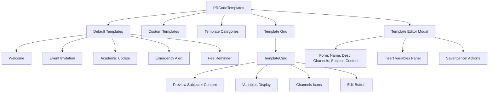
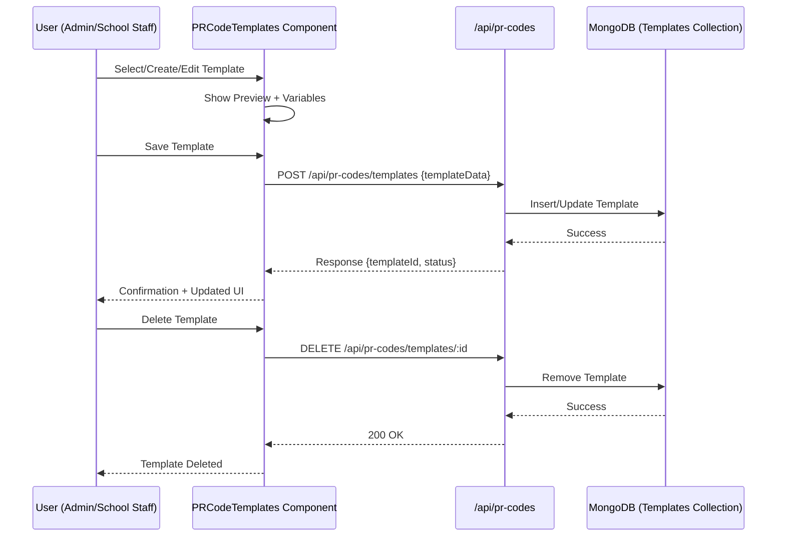
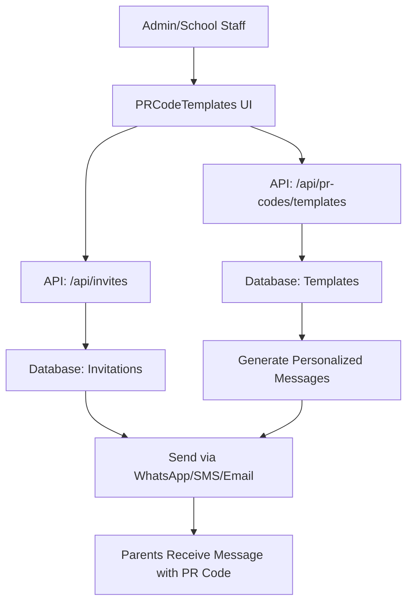

📌 Summary of PRCodeTemplates.js

The PRCodeTemplates component is a comprehensive messaging template manager for schools with PR code integration.

🔑 Core Features

Predefined Templates

Includes welcome, event invitations, academic updates, emergency alerts, and fee reminders.

Each template supports dynamic variables ({{parentName}}, {{schoolName}}, {{prCode}}, etc.).

Multi-channel: WhatsApp, SMS, Email.

Custom Template Management

Users can create, edit, and delete custom templates.

Uses a template editor modal with live variable insertion.

Preview System

Auto-generates previews by replacing variables with sample data (e.g., parent, learner, event info).

Shows subject + body snippet.

Categories & Filtering

Templates grouped by category (welcome, academic, events, financial, emergency, custom).

Each category displays count of templates.

Template Editor

Full form with fields: name, description, channels, subject, content.

Auto-extracts variables from content + subject.

Allows quick insertion of variables via clickable buttons.

User Actions

Create new template ➝ handleCreateTemplate

Edit template ➝ handleEditTemplate

Save template ➝ handleSaveTemplate

Delete custom template ➝ handleDeleteTemplate

Select template ➝ handleTemplateSelect

📊 Mermaid Diagram 1

📊 Mermaid Diagram 2: API & Services Integration

Currently, PRCodeTemplates.js does not directly call APIs, but it’s designed to integrate with them.
Here’s how it would fit in with services:

📊 Mermaid Diagram 3: System Overview (with Invitations)

📌 API Points (Planned / Needed)

For this component to be fully functional:

POST /api/pr-codes/templates → Save new template

GET /api/pr-codes/templates → Fetch templates (default + custom)

PUT /api/pr-codes/templates/:id → Update template

DELETE /api/pr-codes/templates/:id → Delete template

POST /api/invites/send → Use template + PR code to send invites

📌 Services Involved

Database (MongoDB)

Stores templates, variables, custom templates per school.

Messaging Services

WhatsApp (Twilio / Meta API)

SMS (Twilio, Nexmo, or similar)

Email (SendGrid, SES, or Nodemailer)

Analytics

Track template usage, response rate, invite acceptance.