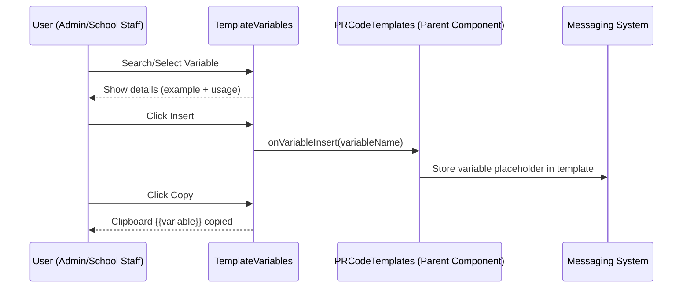
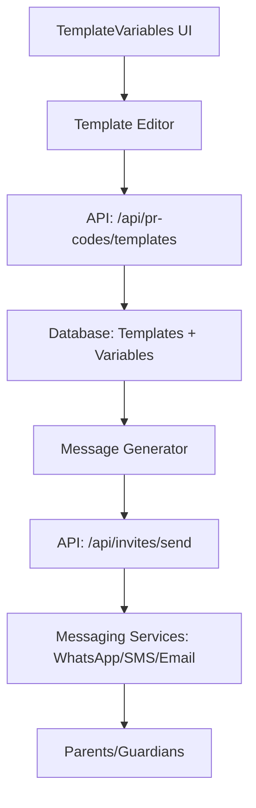

📌 Summary of TemplateVariables.js

This component provides a variable management system for message templates with PR codes.

🔑 Core Features

Variable Categories

Groups variables into categories:

Personal (parentName, learnerName, teacherName, principalName)

School (schoolName, grade, subject, contactEmail, contactNumber)

PR Codes (prCode, shortUrl, portalUrl, trackingId)

Academic (currentGrade, performanceRating, achievements, nextSteps)

Events (eventName, eventDate, eventTime, eventLocation, eventDescription)

Financial (amountDue, dueDate, paymentMethods, bankDetails, officeHours)

System (currentDate, currentTime, schoolYear, term)

Variable Metadata

Each variable has:

Name (code identifier)

Display Name

Description

Example Value

Usage snippet ({{variable}})

Optional flags: required, auto

Search & Filtering

Search bar to filter variables by name/description.

Dropdown + tabs for category filtering.

Variable Actions

Insert variable into template (onVariableInsert)

Copy to Clipboard ({{variable}}) with visual feedback

Quick Actions:

Insert all PR variables

Insert required variables

Insert personal variables

UI & User Guidance

Variable Cards with icons, usage examples, and tags (Required, Auto-filled).

Usage Tips Panel to guide users.
📊 Mermaid Diagram 1: Component Structure
```mermaid
flowchart TD
    A[TemplateVariables Component] --> B[Search & Filter]
    A --> C[Category Tabs]
    A --> D[Variables Grid]
    A --> E[Quick Actions]
    A --> F[Usage Tips]

    D --> G[VariableCard]
    G --> G1[DisplayName + {{variable}}]
    G --> G2[Description + Example + Usage]
    G --> G3[Copy / Insert Actions]
    G --> G4[Tags: Required / Auto]

```
📊 Mermaid Diagram 2: Variable Lifecycle
mermaid

📊 Mermaid Diagram 3: System & API Integration

Even though this component itself doesn’t call APIs, it’s designed to work within the messaging + PR code system:


📌 API Points (Planned/Needed)

For full functionality, integration with APIs/services is expected:

Template Management

GET /api/pr-codes/templates → Fetch templates with variables

POST /api/pr-codes/templates → Save templates with selected variables

PUT /api/pr-codes/templates/:id → Update template variables

DELETE /api/pr-codes/templates/:id → Delete template

Invitation Messaging

POST /api/invites/send → Replace {{variables}} with real data + send

📌 Services Involved

Database (MongoDB)

Store variables metadata + user-created templates.

Message Rendering Engine

Replaces {{variable}} placeholders with actual parent/school data.

Messaging APIs

WhatsApp (Meta API / Twilio)

SMS (Twilio / Nexmo)

Email (SendGrid / SES / Nodemailer)

✅ So TemplateVariables is the dictionary and variable picker for the messaging system — it doesn’t send messages itself but ensures templates are dynamic, complete, and properly tracked.