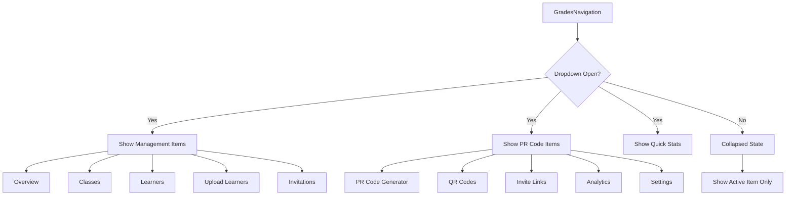

📌 Summary of GradesNavigation.js

The GradesNavigation component is a sidebar navigation menu for managing grades, learners, invitations, and PR codes.

🔑 Key Features:

Two Sections

Management → Grades overview, classes, learners, upload, invitations.

PR Code System → PR code generator, QR codes, invite links, analytics, settings.

Dropdown Toggle

Expand/collapse menu to show categories and items.

Active Tab Handling

Highlights the selected tab.

Shows icon-only in collapsed mode.

Quick Stats Panel

Displays total grades, learners, active PR codes, pending invites, acceptance rate.

UX Enhancements

Tooltips for collapsed items.

Clear category headers.

Separate PR Code features with distinct styling.


📊 Diagram 2: Project Structure (with PR Code Integration)
```mermaid
graph TD
    A[components] --> B[adminPage]
    B --> C[invitations]
    C --> C1[PRCodeGenerator]
    C1 --> C1a[PRCodeGenerator.js]
    C1 --> C1b[PRCodeDisplay.js]
    C1 --> C1c[QRCodeGenerator.js]
    C1 --> C1d[InviteLinkManager.js]

    C --> C2[InvitationComposer]
    C2 --> C2a[InvitationComposer.js]
    C2 --> C2b[ChannelSelector.js]

    C --> C3[TemplateManager]
    C3 --> C3a[PRCodeTemplates.js]
    C3 --> C3b[TemplateVariables.js]

    B --> D[sidebar/GradesNavigation.js]

    A --> E[auth/invite]
    E --> E1[[token].js]
    E --> E2[qr-scan.js]
    E --> E3[pr-code-entry.js]

    A --> F[common]
    F --> F1[QRCodeScanner.js]
    F --> F2[PRCodeInput.js]
    F --> F3[InvitationStats.js]

    G[pages] --> G1[api/invites]
    G1 --> G1a[index.js]
    G1 --> G1b[[id].js]
    G1 --> G1c[validate.js]
    G1 --> G1d[pr-codes/index.js]
    G1 --> G1e[pr-codes/[code].js]
    G1 --> G1f[analytics/index.js]

    G --> G2[admin/grades]
    G2 --> G2a[index.js]
    G2 --> G2b[learners.js]
    G2 --> G2c[upload.js]
    G2 --> G2d[invitations]
    G2d --> G2d1[index.js]
    G2d --> G2d2[pr-codes.js]
    G2d --> G2d3[qr-codes.js]
    G2d --> G2d4[analytics.js]
    G2d --> G2d5[settings.js]

    H[lib] --> H1[prcodes.js]
    H --> H2[qrcodes.js]
    H --> H3[invitations.js]
    H --> H4[analytics.js]
    H --> H5[validators.js]

    I[models] --> I1[Invitation.js]
    I --> I2[PRCode.js]
    I --> I3[User.js]
    I --> I4[School.js]
    I --> I5[Analytics.js]

    J[utils] --> J1[exportFormats.js]
    J --> J2[importFormats.js]
    J --> J3[notificationTemplates.js]

```

📌 High-Level Overview

GradesNavigation.js is the entry point for managing both traditional school data (grades, learners) and the new PR Code invitation system.

It improves navigation, adds analytics, and cleanly separates Management and PR Code features.

The project structure supports scalability with reusable components, APIs, and models dedicated to invitations and PR codes.