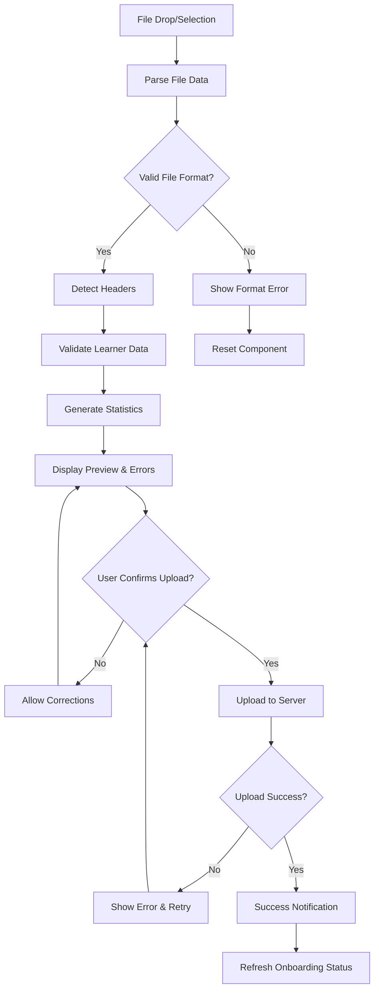
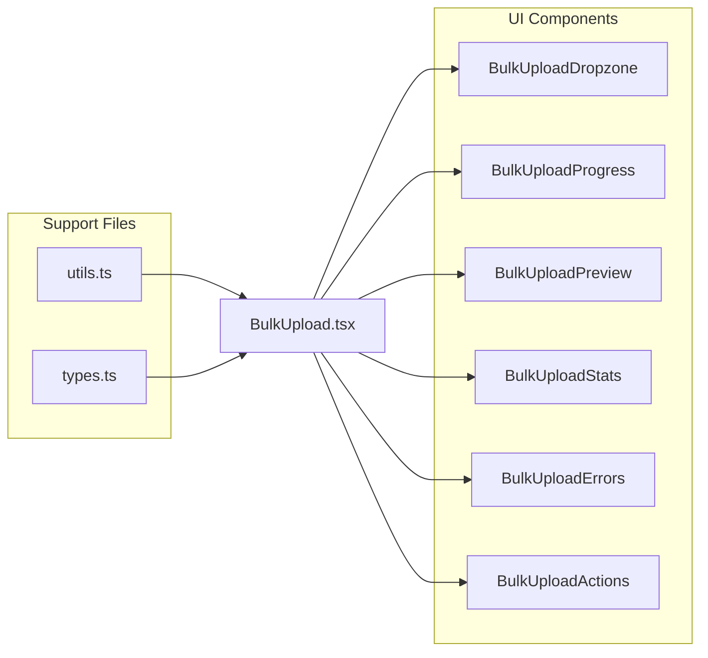
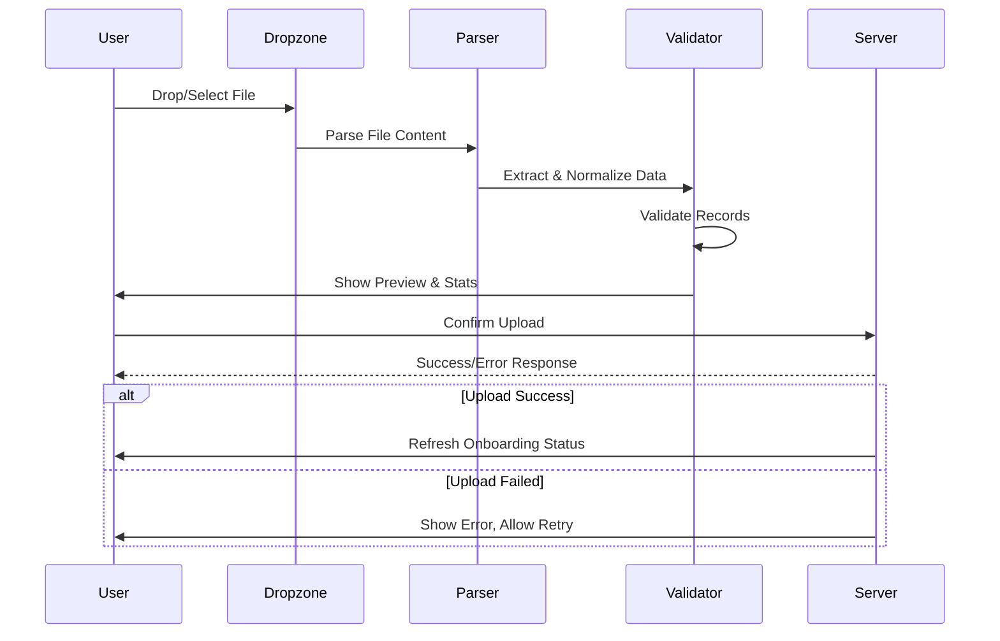
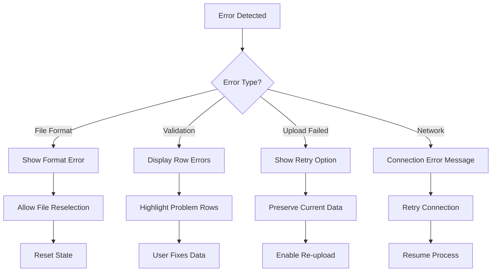

# BulkUpload Component (Onboarding)

The **BulkUpload** component provides a comprehensive interface for uploading learner data in bulk to the SchoolHeadOffice platform. It supports Excel (`.xls`, `.xlsx`) and CSV (`.csv`) file formats, validates data integrity, displays previews, and handles server-side uploads with intuitive user feedback.

---

## Component Flow



---

## Architecture Overview



---

## Folder Structure

```
components/
└── onboarding/
    └── BulkUpload/
        ├── BulkUpload.tsx              # Main container component
        ├── BulkUploadDropzone.tsx      # Drag & drop / file selection
        ├── BulkUploadProgress.tsx      # Progress steps / indicators
        ├── BulkUploadPreview.tsx       # Preview table for first rows
        ├── BulkUploadStats.tsx         # Stats cards (valid, invalid, duplicates)
        ├── BulkUploadErrors.tsx        # Errors & warnings display
        ├── BulkUploadActions.tsx       # Confirm & Upload button
        ├── utils.ts                    # Helper functions (validate, normalize, parse)
        ├── types.ts                    # TypeScript types
        └── README.md                   # Component documentation
```

---

## Features

### 1. **File Upload & Processing**
- **Multi-format Support**: Accepts `.xls`, `.xlsx`, and `.csv` files
- **Drag & Drop Interface**: Intuitive file selection with visual feedback
- **Automatic Header Detection**: Intelligently identifies first name and last name columns
- **File Validation**: Ensures proper file format and structure

### 2. **Data Validation & Normalization**
- **Field Cleaning**: Normalizes phone numbers and learner data fields
- **Required Field Validation**: Validates `firstName`, `lastName`, `gender`, and other mandatory fields
- **Duplicate Detection**: Identifies and flags duplicate learner records
- **Error Classification**: Distinguishes between warnings and critical errors

### 3. **Interactive Preview System**
- **Data Preview**: Displays first few valid rows in an organized table
- **Error Highlighting**: Visual indicators for invalid or problematic rows
- **Statistics Dashboard**: Real-time counts of total, valid, invalid, and duplicate records

### 4. **Robust Upload Management**
- **Authenticated Uploads**: Secure data transmission using Auth0 ID and school ID
- **Progress Tracking**: Step-by-step progress indicators throughout the process
- **Real-time Feedback**: Toast notifications for success, failure, and validation states
- **Error Recovery**: Prevents modal closure on failure, allowing users to address issues

### 5. **User Experience Enhancements**
- **State Preservation**: Maintains component state to avoid data loss during error correction
- **Reset Functionality**: One-click reset for starting fresh uploads
- **Responsive Design**: Works seamlessly across desktop and mobile devices

---

## Data Processing Pipeline



---

## Usage

```tsx
import { BulkUpload } from './BulkUpload/BulkUpload';
import { School, User, Grade } from './BulkUpload/types';

<BulkUpload
  schools={schoolsArray}
  user={currentUser}
  selectedGrade={selectedGrade}
  refetchOnboardingStatus={async () => { /* refresh data */ }}
  onUploadSuccess={(result) => { console.log('Upload result:', result); }}
/>
```

### Props

| Prop | Type | Required | Description |
|------|------|----------|-------------|
| `schools` | `School[]` | ✅ | Array of schools associated with the user |
| `user` | `User \| null` | ✅ | Current logged-in user object |
| `selectedGrade` | `Grade \| null` | ✅ | Grade to assign uploaded learners |
| `refetchOnboardingStatus` | `() => Promise<void>` | ❌ | Optional function to refresh onboarding state after successful upload |
| `onUploadSuccess` | `(result: any) => void` | ❌ | Callback fired after a successful upload |

---

## Component Breakdown

### Core Components

#### **BulkUploadDropzone**
- Handles file drag-and-drop and selection interface
- Validates file types and sizes
- Provides visual feedback during file operations

#### **BulkUploadProgress**
- Displays current step in the upload process
- Shows progress indicators (Upload → Validate → Confirm → Success)
- Provides clear navigation context

#### **BulkUploadPreview**
- Renders tabular preview of valid learner data
- Highlights the first few rows for user verification
- Responsive table design with proper column sizing

#### **BulkUploadStats**
- Displays statistical summary cards
- Shows counts for total, valid, invalid, and duplicate records
- Color-coded indicators for different data states

#### **BulkUploadErrors**
- Lists detailed row-level errors and warnings
- Provides actionable feedback for data corrections
- Categorizes issues by severity level

#### **BulkUploadActions**
- Houses the primary "Confirm & Upload" functionality
- Integrates with `react-hot-toast` for user notifications
- Manages upload state and error handling

### Utility Functions

#### **utils.ts**
Contains essential helper functions:
- **Header Detection**: Automatically identifies data columns
- **Phone Normalization**: Standardizes phone number formats
- **Data Validation**: Comprehensive learner record validation
- **Duplicate Detection**: Identifies and flags duplicate entries

#### **types.ts**
Defines TypeScript interfaces:
- `Learner`: Core learner data structure
- `ValidationResults`: Validation outcome types
- `ProcessedFileResult`: File processing results
- `UploadStats`: Statistical data types

---

## Error Handling Strategy



---

## Integration Notes

- **Authentication**: Fully integrated with Auth0 for secure user identification
- **Toast Notifications**: Uses `react-hot-toast` for non-intrusive user feedback
- **TypeScript**: Complete type safety with comprehensive interface definitions
- **React Hooks**: Modern hooks-based architecture for optimal performance
- **State Management**: Robust state handling to prevent data loss during error correction

---

## Development Guidelines

1. **State Preservation**: Always maintain component state during error scenarios
2. **User Feedback**: Provide clear, actionable feedback for all operations
3. **Performance**: Optimize for large file uploads and data processing
4. **Accessibility**: Ensure keyboard navigation and screen reader compatibility
5. **Testing**: Validate with various file formats and data scenarios

---

## License

© 2025 SchoolHeadOffice. All rights reserved.

This component is part of the SchoolHeadOffice platform and is proprietary software. Unauthorized use, distribution, or modification is prohibited.