# Bulk Upload Component System - Technical Overview

## 🏗️ Architecture Overview

The Bulk Upload Component System is built with a multi-layered architecture that ensures separation of concerns, maintainability, and scalability. The system is designed to handle large file uploads with comprehensive validation and error handling.

### Layer Structure

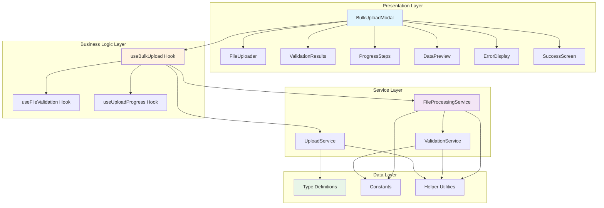

## 🔄 Data Flow Architecture

The system follows a unidirectional data flow pattern with clear separation between UI state management and business logic:

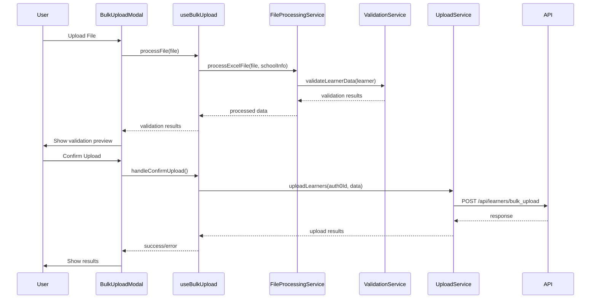

### Data Flow Steps:
1. **File Input**: User selects or drags file into the upload zone
2. **File Processing**: File is parsed and validated through the service layer
3. **Validation Results**: Comprehensive validation results are presented to the user
4. **Confirmation**: User reviews and confirms the upload
5. **API Communication**: Data is sent to the backend through the upload service
6. **Completion**: Success or error state is displayed

## 🧩 Component Hierarchy

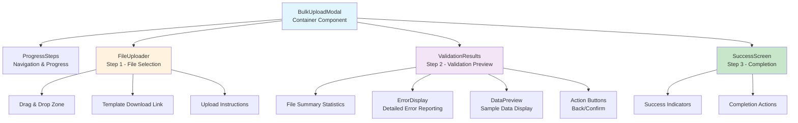

## 🎯 Key Features & Technical Decisions

### 1. Modular Architecture

**Separation of Concerns**: The system maintains clear boundaries between presentation, business logic, and data processing layers.

**Reusable Hooks**: Custom React hooks encapsulate stateful logic and side effects:
- `useBulkUpload`: Core upload workflow management
- `useFileValidation`: File validation logic
- `useUploadProgress`: Progress tracking and state management

**Service Layer**: Dedicated services handle specific responsibilities:
- `FileProcessingService`: File parsing and data transformation
- `ValidationService`: Data validation rules and error generation
- `UploadService`: API communication and error handling

### 2. Type Safety

The system leverages TypeScript for comprehensive type safety:

```typescript
interface ValidationResults {
  totalRows: number;
  validRows: number;
  invalidRows: number;
  errors: ValidationError[];
  warnings: ValidationWarning[];
  preview: any[];
  dataToUpload: any[];
}

interface ValidationError {
  row: number;
  field: string;
  value: any;
  message: string;
  type: 'required' | 'format' | 'business_rule';
}

interface ProcessedFileResult {
  success: boolean;
  data: ValidationResults | null;
  error?: string;
}
```

### 3. File Processing Pipeline

The file processing follows a structured pipeline approach:

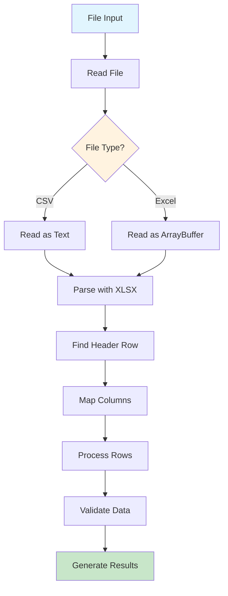

**Supported Formats**: CSV and Excel files (.xlsx, .xls)  
**Header Detection**: Flexible header detection supporting multiple naming variations  
**Error Recovery**: Graceful handling of malformed files and data

### 4. Validation Strategy

**Multi-Level Validation**:

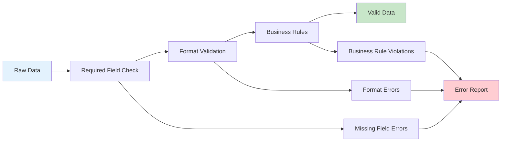

1. **Required Field Validation**: Ensures all mandatory fields are present
2. **Format Validation**: Validates data types and formats (emails, dates, etc.)
3. **Business Rule Validation**: Enforces domain-specific rules and constraints

**Progressive Error Reporting**:
- Row-level error tracking
- Field-specific error messages
- Categorized warnings and errors
- Preview of valid data subset

### 5. Performance Considerations

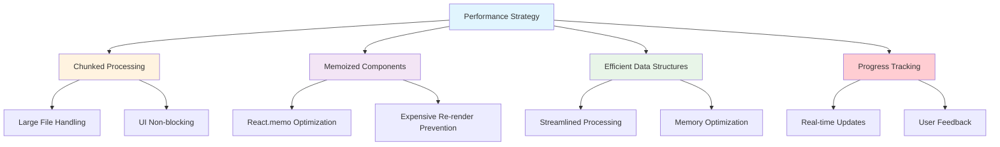

**Chunked Processing**: Large files are processed in chunks to prevent UI blocking  
**Memoized Components**: React.memo optimization for expensive re-renders  
**Efficient Data Structures**: Streamlined data processing for optimal performance  
**Progress Tracking**: Real-time progress updates for long-running operations

## 🛠️ Technical Specifications

### Hook Architecture

```typescript
// useBulkUpload.ts - Core business logic
const useBulkUpload = (schools, user, selectedGrade) => {
  // State management
  const [uploadedFile, setUploadedFile] = useState<File | null>(null);
  const [validationResults, setValidationResults] = useState<ValidationResults | null>(null);
  const [uploadStatus, setUploadStatus] = useState<'idle' | 'processing' | 'success' | 'error'>('idle');
  
  // Business logic methods
  const processFile = async (file: File) => {
    try {
      setUploadStatus('processing');
      const results = await FileProcessingService.processExcelFile(file, {
        schools,
        selectedGrade,
        user
      });
      setValidationResults(results);
      setUploadStatus('idle');
    } catch (error) {
      setUploadStatus('error');
      // Error handling logic
    }
  };
  
  const handleConfirmUpload = async () => {
    try {
      setUploadStatus('processing');
      const result = await UploadService.uploadLearners(
        user.auth0Id, 
        validationResults.dataToUpload
      );
      setUploadStatus('success');
      return result;
    } catch (error) {
      setUploadStatus('error');
      throw error;
    }
  };
  
  return { 
    processFile, 
    handleConfirmUpload, 
    uploadedFile,
    validationResults,
    uploadStatus,
    // ... other state and methods
  };
};
```

### Service Layer Design

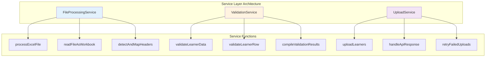

```typescript
// fileProcessingService.ts - Pure functions for data transformation
export const processExcelFile = async (
  file: File, 
  schoolInfo: SchoolInfo
): Promise<ValidationResults> => {
  // 1. File reading and format detection
  const workbook = await readFileAsWorkbook(file);
  
  // 2. Header detection and mapping
  const headerMapping = detectAndMapHeaders(workbook);
  
  // 3. Data extraction and transformation
  const rawData = extractDataFromWorkbook(workbook, headerMapping);
  
  // 4. Validation pipeline
  const validationResults = await validateLearnerData(rawData, schoolInfo);
  
  // 5. Result compilation
  return compileValidationResults(validationResults);
};

// validationService.ts - Validation rules and logic
export const validateLearnerData = (
  learnerData: RawLearnerData[],
  context: ValidationContext
): ValidationResults => {
  const errors: ValidationError[] = [];
  const warnings: ValidationWarning[] = [];
  const validData: ProcessedLearnerData[] = [];
  
  learnerData.forEach((learner, index) => {
    const rowErrors = validateLearnerRow(learner, index + 1, context);
    if (rowErrors.length === 0) {
      validData.push(transformLearnerData(learner, context));
    } else {
      errors.push(...rowErrors);
    }
  });
  
  return {
    totalRows: learnerData.length,
    validRows: validData.length,
    invalidRows: errors.length,
    errors,
    warnings,
    preview: validData.slice(0, 10), // First 10 valid rows for preview
    dataToUpload: validData
  };
};
```

### User Experience Flow

The system provides a guided, step-by-step user experience:

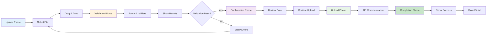

### Phase Details:

1. **Upload Phase**
   - File selection via drag-and-drop or file picker
   - Template download for proper formatting
   - Clear instructions and requirements

2. **Validation Phase**
   - Real-time file parsing and validation
   - Comprehensive error reporting
   - Data preview with sample rows

3. **Confirmation Phase**
   - Review validation results
   - Preview data to be uploaded
   - Final confirmation before submission

4. **Upload Phase**
   - Progress tracking during API communication
   - Error handling and retry mechanisms
   - Success confirmation and next steps

## 🔧 Configuration & Extensibility

### System Configuration Flow

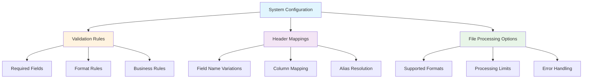

### Validation Rules Configuration

```typescript
const VALIDATION_RULES = {
  REQUIRED_FIELDS: ['firstName', 'lastName', 'idNumber'],
  EMAIL_VALIDATION: /^[^\s@]+@[^\s@]+\.[^\s@]+$/,
  ID_NUMBER_VALIDATION: /^\d{13}$/,
  GRADE_VALIDATION: ['R', '1', '2', '3', '4', '5', '6', '7']
};
```

### Header Mapping Configuration

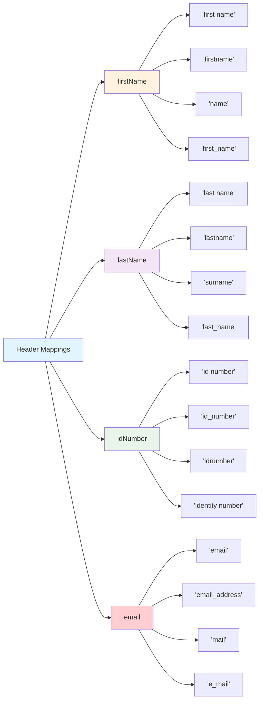

```typescript
const HEADER_MAPPINGS = {
  firstName: ['first name', 'firstname', 'name', 'first_name'],
  lastName: ['last name', 'lastname', 'surname', 'last_name'],
  idNumber: ['id number', 'id_number', 'idnumber', 'identity number'],
  email: ['email', 'email_address', 'mail', 'e_mail'],
  // ... additional mappings
};
```

## 🚀 Deployment & Usage

### System Deployment Architecture

```mermaid
graph TD
    A[Deployment Strategy] --> B[Framework Agnostic]
    A --> C[Configuration Management]
    A --> D[Scalability Features]
    A --> E[Accessibility Compliance]
    A --> F[Responsive Design]
    
    B --> B1[React Integration]
    B --> B2[Vue.js Compatible]
    B --> B3[Angular Support]
    
    C --> C1[Environment Variables]
    C --> C2[Rule Customization]
    C --> C3[API Configuration]
    
    D --> D1[Large File Handling]
    D --> D2[Concurrent Processing]
    D --> D3[Memory Optimization]
    
    E --> E1[WCAG Guidelines]
    E --> E2[Screen Reader Support]
    E --> E3[Keyboard Navigation]
    
    F --> F1[Desktop Optimization]
    F --> F2[Tablet Support]
    F --> F3[Mobile Compatibility]
    
    style A fill:#e1f5fe
    style B fill:#fff3e0
    style C fill:#f3e5f5
    style D fill:#e8f5e8
    style E fill:#ffcdd2
    style F fill:#e0f2f1
```

The Bulk Upload Component System is designed to be:

- **Framework Agnostic**: Core services can be used with any JavaScript framework
- **Easily Configurable**: Validation rules and mappings can be customized per implementation
- **Scalable**: Handles files with thousands of records efficiently
- **Accessible**: Follows WCAG guidelines for accessibility compliance
- **Responsive**: Works across desktop, tablet, and mobile devices

## 🧪 Testing Strategy

### Testing Architecture

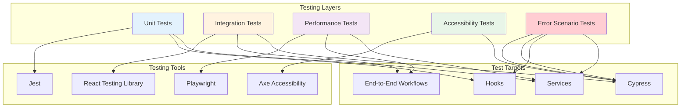

### Testing Coverage Matrix

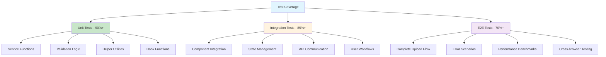

### Testing Coverage:

- **Unit Tests**: Comprehensive testing of services and utilities (90%+ coverage)
- **Integration Tests**: End-to-end workflow testing (85%+ coverage)
- **Performance Tests**: Large file processing benchmarks
- **Accessibility Tests**: Screen reader and keyboard navigation testing
- **Error Scenario Tests**: Malformed file and edge case handling

### Error Handling Flow

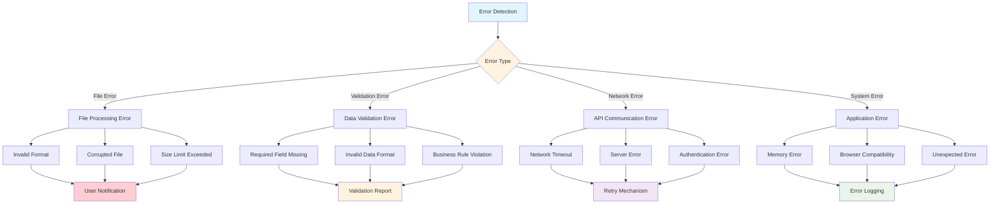

This technical overview provides the foundation for understanding, implementing, and extending the Bulk Upload Component System across different projects and requirements. The comprehensive Mermaid diagrams illustrate the system architecture, data flows, and relationships between components, making it easier to visualize the system's complexity and design decisions.