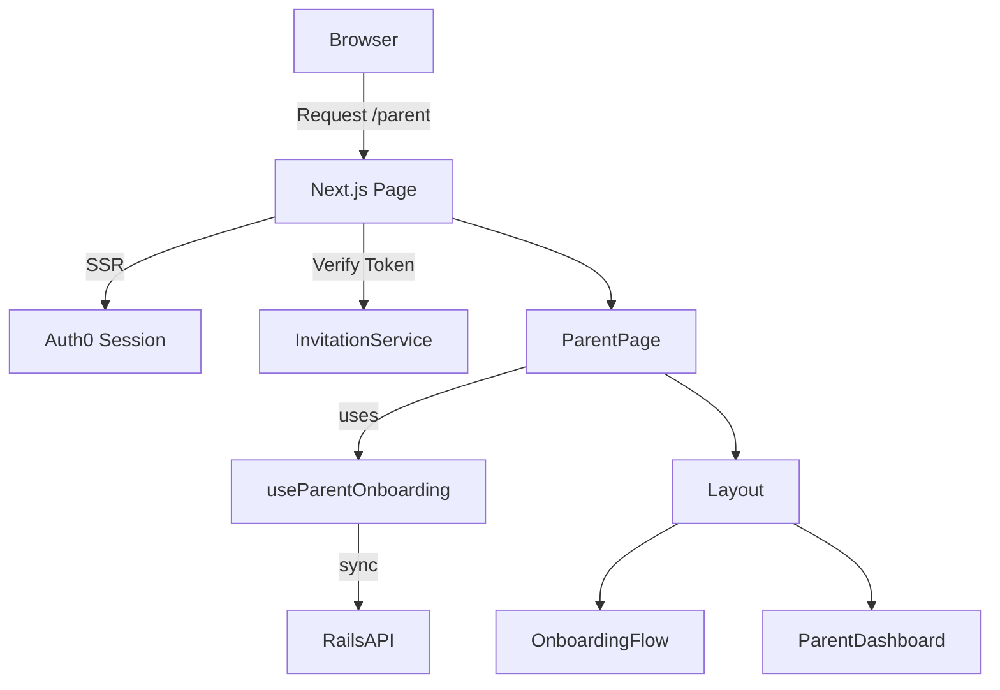
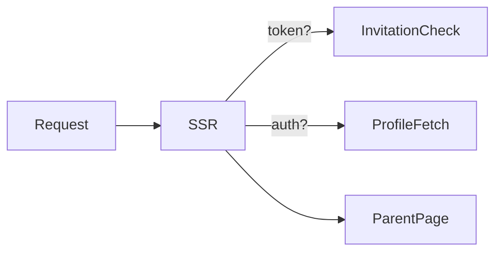
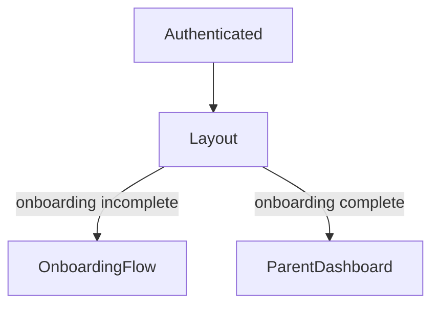
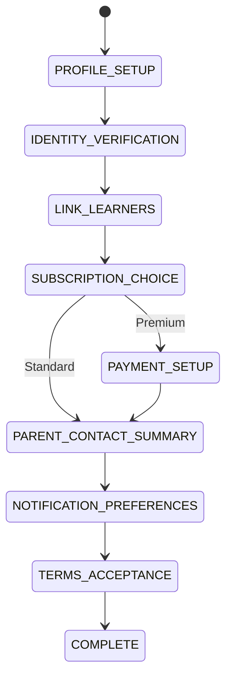
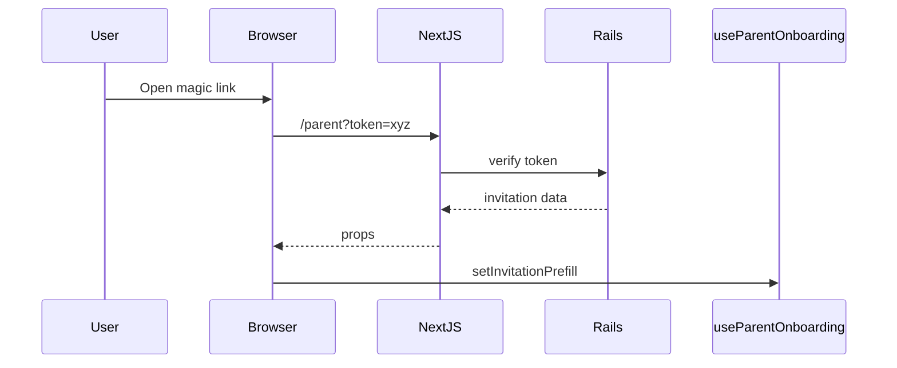
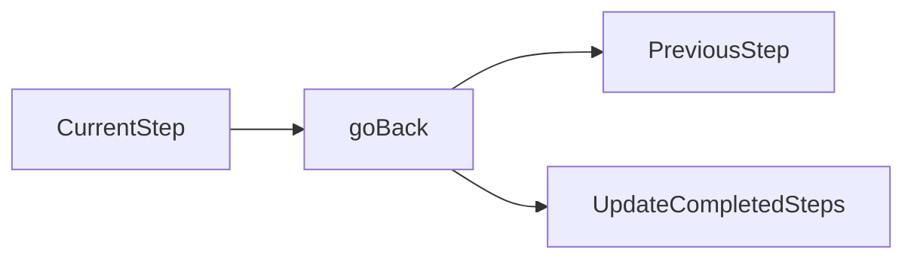
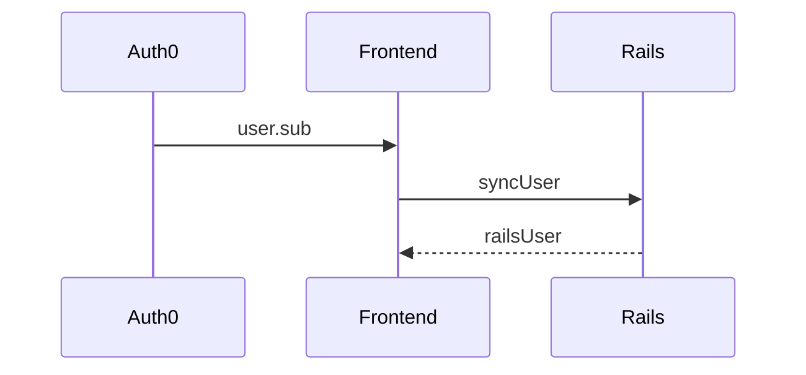

# Parent Onboarding – Architecture & Flow

This document explains the **Parent Onboarding system**, its **project structure**, **data flow**, and **step-based state machine**. It is intended as a technical reference for developers working on the Parent Portal.

---

## 📌 Goals of the Parent Onboarding System

The onboarding flow is designed to:

* Support **magic-link invitations** (WhatsApp / SMS)
* Handle **authenticated and unauthenticated users** safely
* Prefill data from invitations while allowing edits
* Guide parents through a **multi-step onboarding process**
* Persist progress and prevent layout switching issues
* Cleanly transition from onboarding → dashboard

---

## 🧱 High-Level Architecture



---

## 📂 Project Structure (Markdown View)

```md
/pages
└── parent/
    └── index.tsx                # SSR entry point + layout controller

/components
└── parent/
    └── Onboarding/
        ├── OnboardingFlow.tsx   # Step renderer + orchestration
        ├── OnboardingProgress.tsx
        ├── BackButton.tsx
        ├── steps/
        │   ├── ProfileSetup.tsx
        │   ├── IdentityVerification.tsx
        │   ├── LinkLearners.tsx
        │   ├── SubscriptionChoice.tsx
        │   ├── PaymentSetup.tsx
        │   ├── ParentContactSummary.tsx
        │   ├── NotificationPreferences.tsx
        │   ├── TermsAcceptance.tsx
        │   └── README.md
        └── README.md

/lib
└── hooks/
    └── useParentOnboarding.ts   # Core state machine hook

/lib/services
├── invitation.service.ts        # Invitation verification & claiming
├── parent.service.ts            # SSR-safe parent data fetching
└── userSyncService.ts           # Auth0 → Rails sync

/lib/api
└── parent-api.ts                # Client-side API wrapper
```

---

## 🧠 Core Concepts

### 1. **Single Source of Truth: `useParentOnboarding`**

All onboarding state lives in **one hook**:

* `currentStep`
* `completedSteps`
* `onboardingData`
* `progress`
* `isOnboardingComplete`

This prevents step desynchronization and layout flickering.

---

### 2. **SSR Entry Point – `/pages/parent/index.tsx`**

Responsibilities:

* Read Auth0 session
* Verify invitation token (if present)
* Fetch profile & learners (SSR)
* Decide **what to render**, not **how onboarding works**



⚠️ **Important Rule:**

> Authenticated users are **always wrapped in a layout**, whether onboarding or dashboard.

---

### 3. **Layout Stability Rule**



This prevents:

* Layout remounts
* State loss
* Scroll jumps

---

## 🔄 Onboarding State Machine

### Step Order

```ts
PROFILE_SETUP
IDENTITY_VERIFICATION
LINK_LEARNERS
SUBSCRIPTION_CHOICE
(PAYMENT_SETUP – conditional)
PARENT_CONTACT_SUMMARY
NOTIFICATION_PREFERENCES
TERMS_ACCEPTANCE
COMPLETE
```

### Mermaid – Step Flow



---

## 📨 Invitation Handling

### Invitation Lifecycle



### Key Behaviors

* Invitation data is:

  * Stored in `sessionStorage`
  * Merged into onboarding state
  * Locked until user clicks **Edit**
* Invitation is **claimed only after final step**

---

## 🔙 Back Navigation Rules

* Back button:

  * Disabled on first step
  * Uses state machine, **not browser history**
* Removes current step from `completedSteps`



---

## 📊 Progress Calculation

Progress is computed as:

```ts
progress = completedSteps / TOTAL_STEPS * 100
```

* Conditional steps do **not** inflate progress
* Progress bar reflects logical completion, not UI order

---

## 🔐 Authentication & Sync



Handled inside `useParentOnboarding`:

* Runs once per session
* Safe to retry
* Blocks onboarding until sync completes

---

## ✅ Why This Design Works

✔ Predictable state machine
✔ No layout switching bugs
✔ Invitation-safe onboarding
✔ SSR + CSR compatible
✔ Easy to debug (step-level logs)

---

## 🚀 Future Improvements

* Persist onboarding state server-side
* Resume onboarding across devices
* Replace `Set` with XState or Zustand
* Feature-flag steps per school

---

## 🧾 Summary

This onboarding system is **state-driven, invitation-aware, and layout-stable**. All complexity is intentionally centralized in `useParentOnboarding`, keeping pages and components declarative and predictable.

> If something breaks — look at the hook first.
