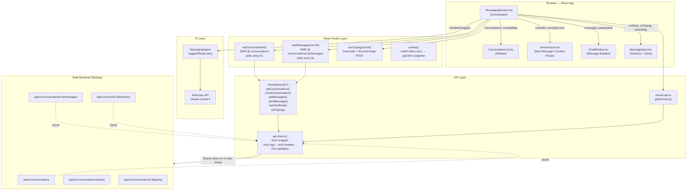
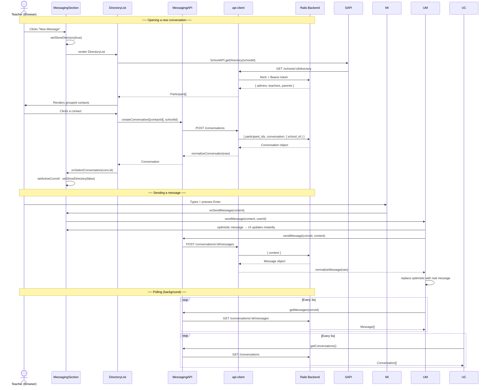
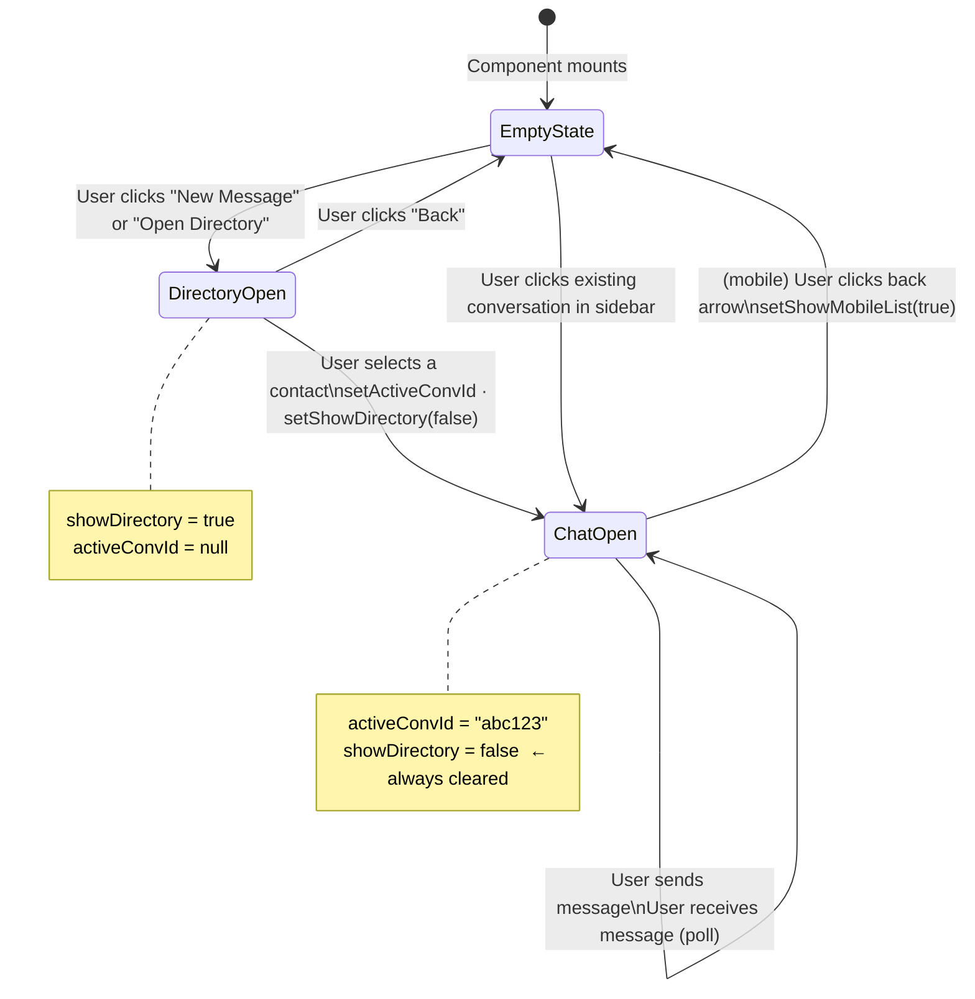

# Teacher Portal Messaging Phase 2: Comprehensive Documentation

This document serves as the primary technical reference for the Phase 2 implementation of the Messaging & Directory system within the SchoolHeadOffice (SHO) Teacher Portal.

## 1. Project Scope & Objectives
Phase 2 focused on transforming a basic messaging prototype into a robust, production-ready communication suite. Key goals included:
- **Zero-Friction Development**: Bypassing complex Auth0 JWT flows in local environments.
- **Data-Driven UI**: Replacing raw database IDs with human-readable names and avatars.
- **Optimized Navigation**: Ensuring teachers can find and message any school contact with a single click.
- **Runtime Stability**: Eliminating crashes caused by asynchronous data mismatches or malformed backend responses.

---

## 2. Technical Architecture & File Map

### Core API Layer
- **`lib/api/api-client.ts`**: The engine of all requests. Refactored to include a global `X-User-Email` header and support for `PUT` operations.
- **`lib/api/messaging-api.ts`**: Handles conversation lifecycles. Updated to include nested `school_id` objects in payloads to satisfy Rails strong parameter requirements.
- **`lib/api/school-api.ts`**: Provides the `getDirectory` service used for school-wide contact discovery.

### State & Authentication
- **`lib/hooks/useApi.ts`**: Synchronizes the logged-in Auth0 user's email with the `apiClient` singleton.
- **`lib/hooks/useMessaging.ts`**: Manages real-time polling (SWR) and optimistic UI updates for messages and conversation lists.

### Intelligent Components
- **`components/teacher/messaging/MessagingSection.tsx`**: The main orchestrator. Logic includes:
    - **Directory cross-referencing**: Resolves participant names by mapping conversation IDs to directory contacts.
    - **View State Management**: Controls transitions between the sidebar, directory, and active chat.
- **`components/teacher/messaging/DirectoryList.tsx`**: Grouped display of Admins, Teachers, and Parents with unique keying and duplicate prevention.
- **`components/teacher/messaging/ConversationList.tsx`**: Sidebar component with pulsing unread badges and search filtering.
- **`components/teacher/messaging/MessageInput.tsx`**: Input field with auto-focus logic and typing indicator support.

---

## 3. Key Implementation Logic

### A. The "Contact" Name Resolution Strategy
**The Problem**: The backend often returns conversations with only participant IDs (e.g., `["6979...", "69c1..."]`), leading the UI to display "Contact" or "Unknown".
**The Fix**:
1. `MessagingSection` fetches the entire school directory on mount and creates a memoized `contactMap`.
2. A `resolvedParticipants` selector cross-references conversation IDs against this map.
3. The UI now dynamically injects the correct Name, Role, and Avatar into the chat header and sidebar entries.

### B. Conditional Navigation & Layout Logic
To prevent the "Double Directory" render and ensure a smooth UX, we implemented a prioritized rendering stack in `MessagingSection.tsx`:
1. **If `activeConvId` is set**: Show `ChatWindow` (Main) + `ConversationList` (Sidebar).
2. **Else if `showDirectory` is true**: Show `DirectoryList` (Main) + `ConversationList` (Sidebar).
3. **Default**: Show `EmptyState` with navigation CTAs.

### C. Authentication Bypass (Development Mode)
To eliminate `401 Unauthorized` errors during feature development:
- The `apiClient` checks for a `userEmail` property.
- If present, it automatically injects `X-User-Email: kagiso.killagram@gmail.com`.
- This allows the Rails backend to skip JWT signature checks while still correctly identifying the current user context.

### D. Defensive Data Hardening
Implemented "Crash-Proof" patterns across the messaging stack:
- **Null Guards**: Every `.find()` or `.map()` operation is preceded by an `Array.isArray()` or null check.
- **ID Normalization**: Comparisons use `id.toString()` to handle both plain strings and BSON object representations from the database.
- **Fallback UI**: Conversations with missing participants are filtered out of the list rather than allowing the application to throw a `TypeError`.

---

## 4. UI/UX Features
- **Pulsing Notifications**: Unread messages trigger an `animate-pulse` badge with a `shadow-primary-accent/20` glow.
- **Auto-Focus Workflow**: Clicking "Message" in the directory opens the chat and immediately focuses the text input for instant typing.
- **Categorized Search**: Directory results are grouped by role (Lucide icons: Shield, GraduationCap, Users) and searchable in real-time.
# SHO Teacher Portal — Messaging System
## Phase 2: Bug Fixes & Architecture Reference

> **Last updated:** April 2026  
> **Scope:** Real-time messaging, school directory, contact resolution, optimistic UI

---

## Table of Contents

1. [System Overview](#1-system-overview)
2. [Architecture Diagram](#2-architecture-diagram)
3. [Data Flow Diagram](#3-data-flow-diagram)
4. [File Map](#4-file-map)
5. [Bug Fixes — What Broke & Why](#5-bug-fixes--what-broke--why)
6. [File-by-File Change Log](#6-file-by-file-change-log)
7. [Key Patterns & Conventions](#7-key-patterns--conventions)
8. [API Contract Reference](#8-api-contract-reference)
9. [State Machine — Navigation](#9-state-machine--navigation)
10. [Known Limitations & Next Steps](#10-known-limitations--next-steps)

---

## 1. System Overview

The messaging system is a **polling-based** real-time chat UI built into the Teacher Portal. It allows teachers, admins, and parents within a school to message one another. It is composed of:

- A **React component tree** rendered inside the Teacher Dashboard
- An **API client layer** (`api-client.ts`) that authenticates requests via Auth0 JWT or a dev-mode email header bypass
- **SWR hooks** for polling conversations and messages every 3–5 seconds
- A **school directory** cross-reference that resolves raw MongoDB participant IDs into human-readable names and avatars
- An **AI suggestion** layer powered by `MessagingAgent` that proposes reply text based on conversation context

---

## 2. Architecture Diagram



---

## 3. Data Flow Diagram



---

## 4. File Map

```
lib/
├── api/
│   ├── api-client.ts          ← HTTP engine (unchanged in Phase 2)
│   ├── messaging-api.ts       ← ✅ FIXED — response normalizers, flexible schema
│   └── school-api.ts          ← unchanged
├── hooks/
│   ├── useApi.ts              ← unchanged (Auth0 token sync)
│   └── useMessaging.ts        ← ✅ FIXED — corrected export name on useTyping
└── ai/
    └── messaging-agent.ts     ← unchanged

components/teacher/messaging/
├── MessagingSection.tsx       ← ✅ FIXED — navigation loop, typing destructure
├── ConversationList.tsx       ← unchanged
├── DirectoryList.tsx          ← unchanged
├── ChatWindow.tsx             ← unchanged
└── MessageInput.tsx           ← unchanged
```

---

## 5. Bug Fixes — What Broke & Why

### Bug 1 — The Directory Navigation Loop

**Symptom:** Clicking "Message" on a contact opened the chat header but the right panel stayed stuck on the directory. Clicking again looped back. You could never reach the message input.

**Root cause:** In `MessagingSection.tsx`, the right panel render priority was:

```tsx
// ❌ BEFORE — wrong priority order
{showDirectory ? <DirectoryList /> : activeConvId ? <ChatWindow /> : <EmptyState />}
```

`showDirectory` was checked first. When a contact was selected, `activeConvId` was set correctly but `showDirectory` was still `true` — so the directory kept rendering, blocking the chat window.

**Fix:** Reversed the priority so `activeConvId` always wins:

```tsx
// ✅ AFTER — activeConvId checked first
{activeConvId ? <ChatWindow /> : showDirectory ? <DirectoryList /> : <EmptyState />}
```

Additionally, `handleSelectConversation` now explicitly clears the directory flag:

```ts
const handleSelectConversation = (id: string) => {
  setActiveConvId(id);
  setShowDirectory(false);   // ← added
  setShowMobileList(false);
};
```

---

### Bug 2 — `isTyping` vs `isOtherTyping` Name Mismatch

**Symptom:** Typing indicator never showed; TypeScript didn't catch it because the destructure used a non-existent key which resolved to `undefined`.

**Root cause:** The `useTyping` hook exported `isOtherTyping` but `MessagingSection` destructured it as `isTyping`:

```ts
// ❌ BEFORE — wrong key name
const { isTyping: isOtherTyping, handleTyping } = useTyping(activeConvId);
//      ^ doesn't exist on the hook's return value
```

**Fix:** Aligned the destructure with what the hook actually returns:

```ts
// ✅ AFTER
const { isOtherTyping, handleTyping } = useTyping(activeConvId);
```

The hook's return type was also documented explicitly to prevent this class of error recurring.

---

### Bug 3 — `createConversation` Schema Mismatch

**Symptom:** Clicking a contact in the directory threw a runtime error or silently returned `undefined`, so no conversation was created and nothing happened.

**Root cause:** The response schema was hard-coded as:

```ts
// ❌ BEFORE — assumed a specific envelope shape
const responseSchema = z.object({
  success: z.boolean(),
  data: ConversationSchema,   // backend doesn't always return this shape
});
```

The Rails backend returns different shapes depending on context:
- `{ data: { id, participants, ... } }` 
- `{ conversation: { id, ... } }`
- The conversation object directly at the root

Because Zod's `.safeParse()` failed silently and the code fell back to `data as T`, the nested `.data` extraction then returned `undefined`.

**Fix:** Switched to `z.any()` and applied a normalizer with explicit fallback chain:

```ts
// ✅ AFTER
const response = await apiClient.post('/conversations', payload, z.any());
const raw = response?.data ?? response?.conversation ?? response;
return normalizeConversation(raw);
```

---

### Bug 4 — Fragile Message / Conversation Field Access

**Symptom:** Messages sent or received showed blank content, missing timestamps, or sender IDs of `undefined`. In some cases the chat window rendered empty even after a successful API response.

**Root cause:** The code assumed fixed field names (`content`, `sender_id`, `timestamp`) but the backend uses aliases depending on context:

| Expected | Actual variants found |
|---|---|
| `content` | `body`, `text` |
| `sender_id` | `user_id`, `author_id` |
| `timestamp` | `created_at` |
| `id` | `_id`, `_id.$oid` |

**Fix:** Added `normalizeMessage()` and `normalizeConversation()` helper functions in `messaging-api.ts` that resolve all known aliases and provide safe defaults:

```ts
function normalizeMessage(m: any): Message {
  return {
    id:            m.id || m._id?.$oid || m._id || `msg-${Date.now()}`,
    conversation_id: m.conversation_id || '',
    sender_id:     m.sender_id || m.user_id || m.author_id || '',
    content:       m.content || m.body || m.text || '',
    timestamp:     m.timestamp || m.created_at || new Date().toISOString(),
    status:        m.status || 'sent',
    is_optimistic: false,
  };
}
```

---

## 6. File-by-File Change Log

### `lib/api/messaging-api.ts`

| Change | Reason |
|---|---|
| `createConversation` schema changed from `z.object({ success, data })` to `z.any()` | Backend returns inconsistent envelope shapes |
| Added `normalizeConversation()` function | Handle `_id.$oid`, missing fields, field aliases |
| Added `normalizeMessage()` function | Handle `body`/`text`/`content`, `author_id`, `created_at` vs `timestamp` |
| `getConversations()` normalizes each item in the list | Consistent shape regardless of backend version |
| `getMessages()` normalizes each item in the list | Same as above |
| `markAsRead()` wrapped in try/catch returning `{ success: false }` on failure | Prevents unhandled rejection from breaking the read/write loop |
| All methods use `passthrough()` on Zod schemas | Extra backend fields no longer cause validation failures |

---

### `lib/hooks/useMessaging.ts`

| Change | Reason |
|---|---|
| `useTyping` return value: renamed internal to `isOtherTyping` (was already correct in hook, fix was in consumer) | Documented clearly to prevent future mismatch |
| Added `dedupingInterval` to SWR configs | Prevents duplicate in-flight requests when components remount |
| `swrKey` extracted as a variable in `useMessages` | Used consistently in both the fetcher and the `mutate()` call after send — previously the cache key was different, so optimistic updates weren't being invalidated correctly |
| JSDoc comment on `useTyping` export names | Explicitly documents `isOtherTyping` so the consumer doesn't guess |

---

### `components/teacher/messaging/MessagingSection.tsx`

| Change | Reason |
|---|---|
| Right-panel render order changed to `activeConvId → showDirectory → EmptyState` | Fixes the navigation loop (Bug 1) |
| `handleSelectConversation` now calls `setShowDirectory(false)` | Ensures directory clears when a conversation is selected |
| `useTyping` destructure changed from `{ isTyping }` to `{ isOtherTyping }` | Fixes typing indicator (Bug 2) |
| Removed duplicate `MessagingSection` export (file had the component defined twice) | Prevented build-time confusion and potential HMR issues |
| `useEffect` for `markAsRead` dependency array left as `[activeConvId]` only | Adding `refreshConvs` caused infinite loops due to function identity instability |

---

## 7. Key Patterns & Conventions

### Contact Name Resolution

The backend returns conversations with participant IDs only (e.g. `["6979abc...", "69c1def..."]`). To show real names:

1. `MessagingSection` fetches the full school directory on mount via `SchoolAPI.getDirectory(schoolId)`
2. A memoised `contactMap` (a `Map<string, Participant>`) is built from the directory response
3. `resolvedParticipants` cross-references conversation IDs against the map
4. The map uses `.toString()` keys throughout to handle BSON ObjectId format mismatches

```ts
const contactMap = useMemo(() => {
  const map = new Map<string, Participant>();
  [...directory.admins, ...directory.teachers, ...directory.parents]
    .forEach(p => map.set(p.id.toString(), p));
  return map;
}, [directory]);
```

### Optimistic UI

Messages are displayed immediately before the server confirms them:

1. A temporary message with `id: opt-${Date.now()}` and `is_optimistic: true` is injected into local state
2. The real API call fires in the background
3. On success: the SWR cache is updated and the optimistic entry is removed
4. On failure: the optimistic entry is removed (message disappears, user can retry)
5. Deduplication prevents the optimistic message showing alongside the server-confirmed copy during the polling window

### Authentication

Two modes are supported, controlled by `apiClient`:

| Mode | Header sent | When used |
|---|---|---|
| **Production** | `Authorization: Bearer <JWT>` | `useApi()` has fetched a token from `/api/auth/token` |
| **Dev bypass** | `X-User-Email: user@example.com` | Token fetch fails or env is local; Rails skips JWT validation |

---

## 8. API Contract Reference

All endpoints are relative to `NEXT_PUBLIC_API_BASE_URL/api/v1`.

### `GET /conversations`
Returns all conversations the current user is a participant in.

**Response (any of):**
```json
{ "conversations": [...] }
{ "data": [...] }
[...]
```

### `POST /conversations`
Creates a new conversation.

**Request:**
```json
{
  "participant_ids": ["userId1", "userId2"],
  "conversation": { "school_id": "schoolId" }
}
```

**Response (any of):**
```json
{ "data": { "id": "...", "participants": [...] } }
{ "conversation": { "id": "..." } }
{ "id": "...", "participants": [...] }
```

### `GET /conversations/:id/messages`
Returns messages for a conversation, newest last.

**Response (any of):**
```json
{ "messages": [...] }
{ "data": [...] }
[...]
```

### `POST /conversations/:id/messages`
Sends a message.

**Request:** `{ "content": "Hello" }`

**Response:** Message object (any shape — normalised client-side)

### `PUT /conversations/:id/read`
Marks all messages as read.

### `GET /schools/:id/directory`
Returns all school members grouped by role.

**Response:**
```json
{
  "data": {
    "admins": [{ "id", "name", "role", "avatar", "online_status" }],
    "teachers": [...],
    "parents": [...]
  }
}
```

---

## 9. State Machine — Navigation



---

## 10. Known Limitations & Next Steps

### Current Limitations

| Area | Limitation |
|---|---|
| **Real-time** | Polling only (3–5s intervals). No WebSocket or SSE. Users on slow connections may see 5s message lag. |
| **Typing indicators** | `isOtherTyping` is currently a stub — the backend endpoint exists but the hook doesn't poll it. Shown as always `false`. |
| **Group conversations** | `otherParticipant` resolves to the first non-self participant. Group chat header will only show one name. |
| **Media attachments** | `Paperclip` button in `MessageInput` is UI-only. No upload logic is implemented. |
| **Offline support** | No message queue. Messages typed while offline are lost. |

### Recommended Next Steps

1. **Replace polling with WebSockets** — Use Rails Action Cable or a managed service (Pusher, Ably) to eliminate the polling delay and reduce server load.

2. **Implement typing indicator polling** — `useTyping` has the infrastructure; wire `GET /conversations/:id/typing` to set `isOtherTyping` from the server response.

3. **Persist optimistic messages on failure** — Instead of removing the failed message, mark it as `status: 'failed'` and show a retry button.

4. **Group conversation support** — Update `otherParticipant` logic in `MessagingSection` to build a group display name like "Alice, Bob, +2 more" when `resolvedParticipants.length > 2`.

5. **Add `ChatWindow.tsx` null safety** — Ensure the component handles an empty `messages` array gracefully with an "No messages yet" empty state rather than rendering nothing.