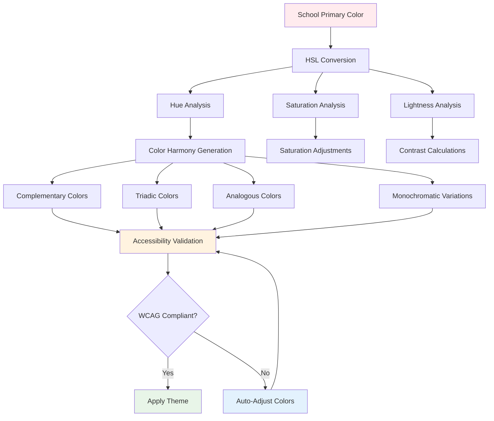
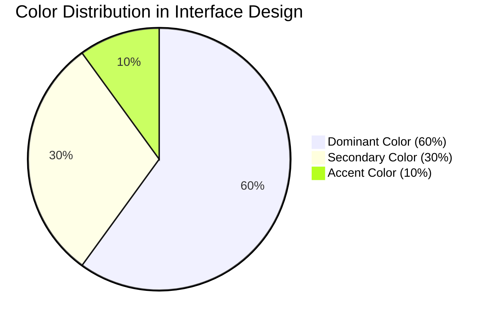
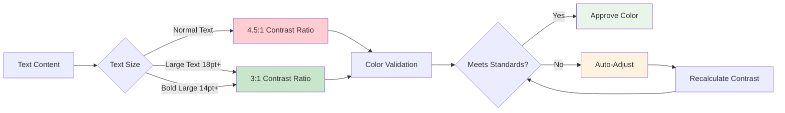
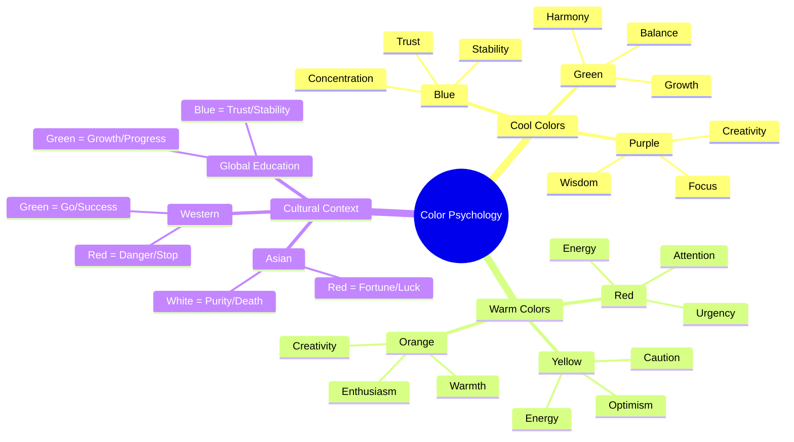
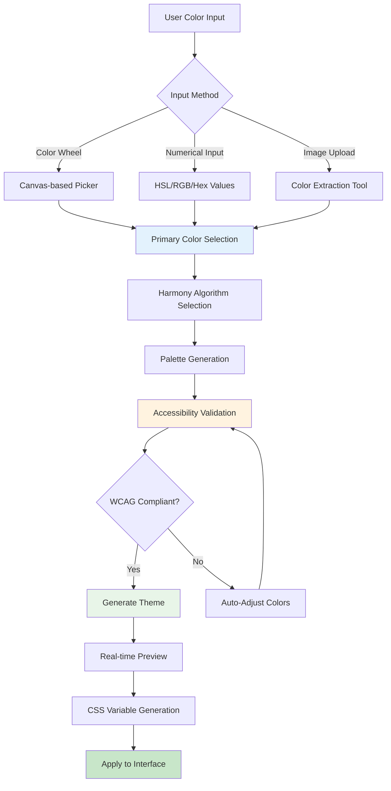
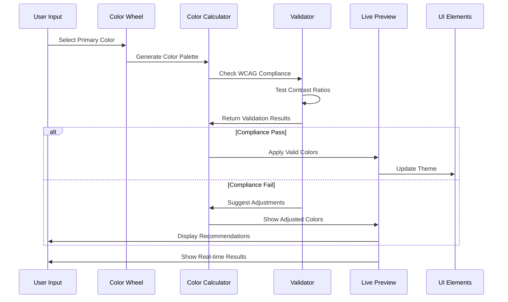
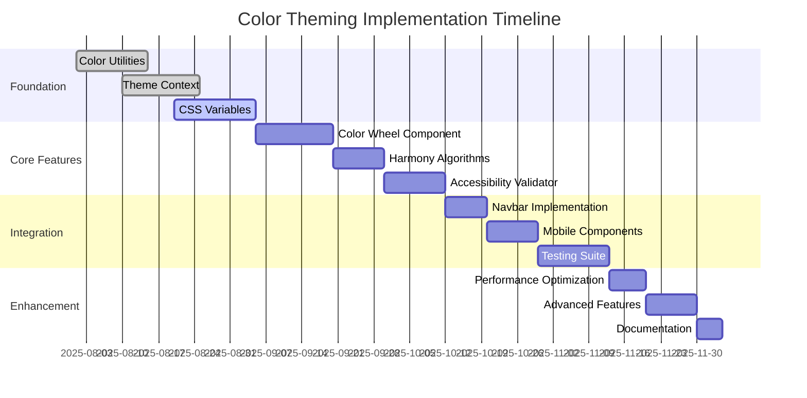
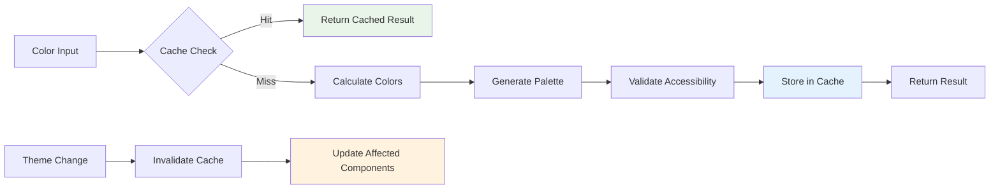
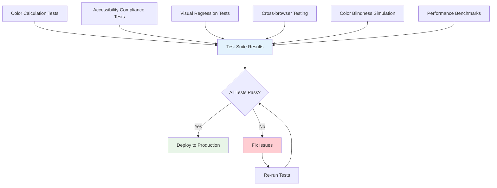
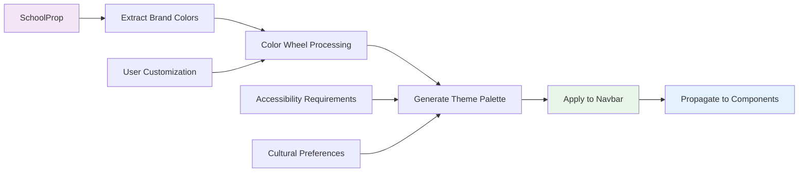

# Color Theme Overview - Dynamic Theming System

**Author:** Kagiso  
**Date:** August 25, 2025  
**Target Audience:** SchoolHeadOffice Developers & Designers  
**Repository:** SchoolHeadOffice_Invitations  
**Related:** [Main Overview](./overview.md)

## Executive Summary

This document provides comprehensive guidance on the color theory foundations, design principles, and interactive color wheel functionality that powers the SchoolProp dynamic theming system. It serves as the theoretical and practical foundation for implementing accessible, aesthetically pleasing, and culturally appropriate color schemes in educational interfaces.

## Color Theory Foundations

### HSL Color Model Architecture

Our theming system is built on the HSL (Hue, Saturation, Lightness) color model, which provides intuitive algorithmic control over color variations while maintaining mathematical relationships essential for systematic color generation.



### Color Harmony Principles

#### Complementary Schemes
- **Purpose**: High contrast and visual impact
- **Use Cases**: Call-to-action elements, important notifications
- **Implementation**: Colors opposite on color wheel (180° separation)
- **Benefits**: Maximum contrast while maintaining harmony

#### Triadic Schemes  
- **Purpose**: Balanced yet vibrant palettes
- **Use Cases**: Multi-category content, diverse interface elements
- **Implementation**: Three evenly spaced colors (120° separation)
- **Benefits**: More variety than complementary while maintaining balance

#### Analogous Schemes
- **Purpose**: Serene, comfortable designs
- **Use Cases**: Extended reading interfaces, focused learning environments
- **Implementation**: Adjacent colors on color wheel (30-60° spread)
- **Benefits**: Reduced visual fatigue, enhanced readability

#### Monochromatic Schemes
- **Purpose**: Sophisticated, professional appearance
- **Use Cases**: Content-focused interfaces, minimalist designs
- **Implementation**: Variations of single hue (saturation/lightness changes)
- **Benefits**: Emphasizes content over interface elements

## Design Principles & Guidelines

### The 60-30-10 Color Distribution Rule



- **Dominant (60%)**: Neutral/subdued primary color variations for backgrounds and major areas
- **Secondary (30%)**: More saturated primary color for major interface elements
- **Accent (10%)**: Complementary/triadic colors for highlights and interactive elements

### Accessibility-First Approach

#### WCAG 2.1 Compliance Standards


#### Color Blindness Considerations
- **Protanopia**: Red-blind (1% of males)
- **Deuteranopia**: Green-blind (6% of males)  
- **Tritanopia**: Blue-blind (rare)
- **Implementation**: Alternative visual cues (icons, typography, spatial relationships)

### Cultural & Psychological Color Impact

#### Educational Environment Considerations


## Color Wheel Functionality

### Interactive Color Selection Architecture



### Advanced Color Selection Features

#### Multi-Input Support
- **Traditional Color Wheel**: Circular hue selection with saturation/lightness controls
- **Numerical Inputs**: Precise hex, RGB, HSL value entry
- **Image Color Picker**: Extract colors from uploaded brand materials
- **Touch/Mobile Support**: Responsive interaction across all devices

#### Real-time Validation & Feedback


### Color Harmony Generation Algorithms

#### Complementary Generation
```javascript
// Pseudocode for complementary color generation
function generateComplementary(primaryHue) {
  const complementaryHue = (primaryHue + 180) % 360;
  return {
    primary: primaryHue,
    complementary: complementaryHue,
    palette: generateAccessibleVariations([primaryHue, complementaryHue])
  };
}
```

#### Triadic Generation
```javascript
// Pseudocode for triadic color generation
function generateTriadic(primaryHue) {
  return {
    primary: primaryHue,
    secondary: (primaryHue + 120) % 360,
    tertiary: (primaryHue + 240) % 360,
    palette: generateAccessibleVariations([primaryHue, primaryHue + 120, primaryHue + 240])
  };
}
```

## Implementation Strategy

### Phase-based Development Approach



### Technical Architecture Components

#### Color Calculation Utilities
```typescript
interface ColorUtils {
  generatePalette(primaryColor: string): ColorPalette;
  calculateContrast(foreground: string, background: string): number;
  adjustForAccessibility(color: string, targetContrast: number): string;
  convertColorFormat(color: string, format: 'hex' | 'rgb' | 'hsl'): string;
  simulateColorBlindness(color: string, type: ColorBlindnessType): string;
}
```

#### Theme Context Provider
```typescript
interface ThemeContextValue {
  currentTheme: ColorTheme;
  setTheme: (theme: ColorTheme) => void;
  generateTheme: (primaryColor: string) => ColorTheme;
  validateAccessibility: (theme: ColorTheme) => ValidationResult;
  colorUtils: ColorUtils;
}
```

## Performance Optimization

### Caching & Memoization Strategy



### Selective Re-rendering
- **Component Memoization**: Prevent unnecessary re-renders when theme unchanged
- **CSS Variable Updates**: Modify styles without component re-renders
- **Debounced Updates**: Batch multiple color changes for efficiency
- **Lazy Loading**: Load complex features on demand

## Testing & Quality Assurance

### Comprehensive Testing Strategy

#### Automated Testing Suite


#### Manual Testing Procedures
- **Aesthetic Evaluation**: Subjective design quality assessment
- **User Experience Testing**: Navigation and interaction validation
- **Accessibility User Testing**: Testing with assistive technologies
- **Cultural Appropriateness Review**: Multi-cultural design validation

## Integration with SchoolProp System

### Data Flow Integration
The color theming system seamlessly integrates with the existing SchoolProp architecture:



## Future Enhancements

### Advanced Features Roadmap
- **Temporal Color Adaptation**: Seasonal/time-based color adjustments
- **Ambient Light Integration**: Automatic adaptation to environmental lighting
- **AI-Powered Color Suggestions**: Machine learning-based palette recommendations
- **Advanced Accessibility Features**: Beyond WCAG compliance for enhanced usability
- **Collaborative Color Selection**: Multi-stakeholder approval workflows

## Best Practices & Guidelines

### Development Standards
1. **Always validate accessibility** before applying color themes
2. **Implement comprehensive fallbacks** for color calculation failures  
3. **Cache expensive calculations** to maintain performance
4. **Provide multiple input methods** for diverse user preferences
5. **Test across color vision types** to ensure universal usability
6. **Document cultural considerations** for international deployments
7. **Monitor performance impact** of dynamic color calculations

### Design Guidelines
1. **Maintain brand identity** while ensuring usability
2. **Use color hierarchies** to guide user attention effectively
3. **Provide sufficient contrast** for all text and interactive elements
4. **Consider color temperature** for educational environments
5. **Balance vibrant and neutral** colors for sustained engagement
6. **Test in realistic contexts** with actual content and usage patterns

---

*This color theme overview works in conjunction with the [main overview](./overview.md) to provide comprehensive guidance for implementing dynamic theming in the SchoolHeadOffice application.*