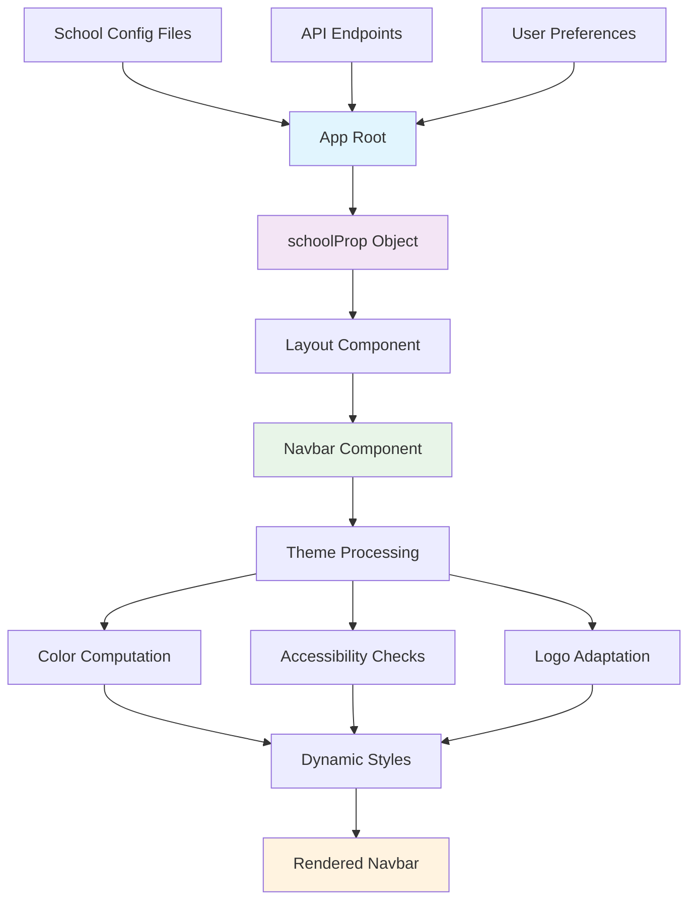
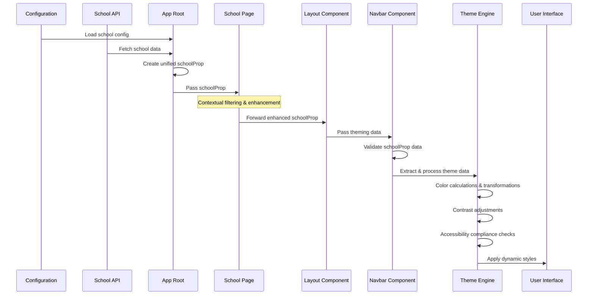
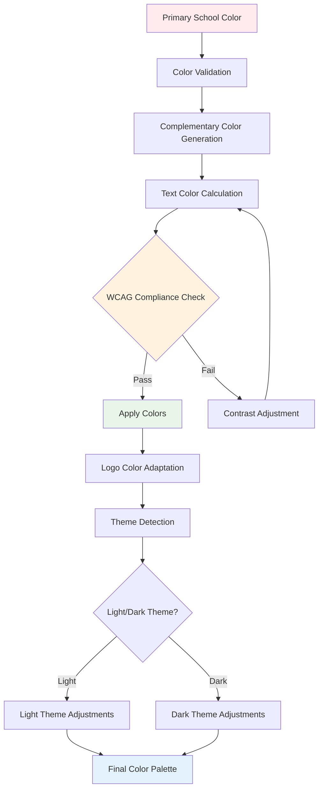
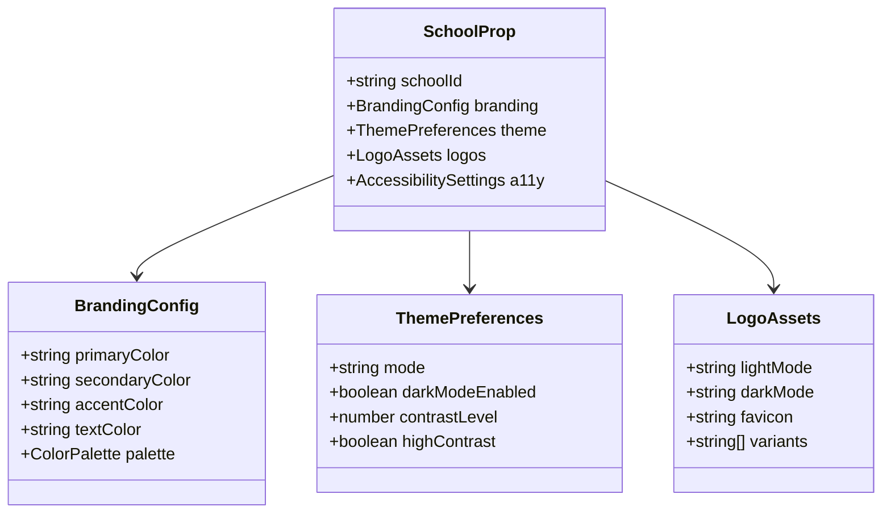
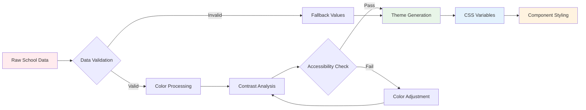
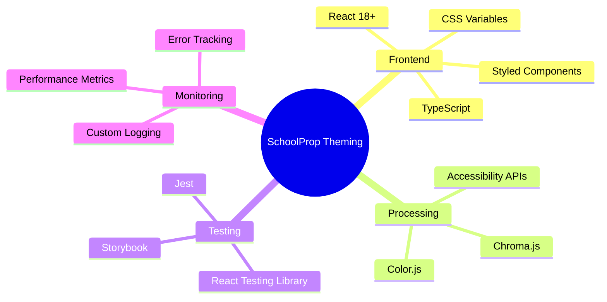
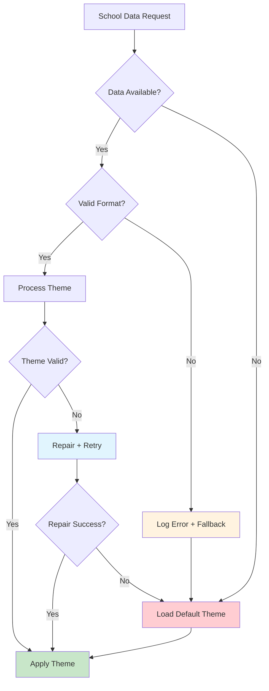
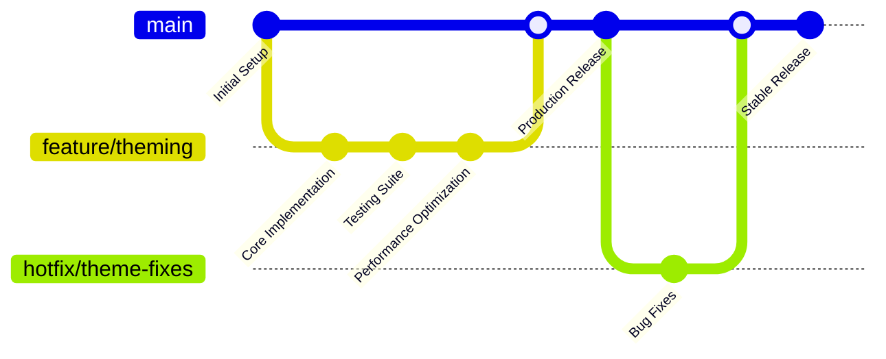

# SchoolProp Dynamic Theming - Overview

**Author:** Kagiso  
**Date:** August 25, 2025  
**Target Audience:** SchoolHeadOffice Developers  
**Repository:** SchoolHeadOffice_Invitations

## Executive Summary

This document provides an overview of the dynamic theming implementation for the SchoolHeadOffice application. The system enables automatic navbar color adaptation based on school branding, ensuring visual consistency while maintaining accessibility and performance standards.

## System Architecture Overview



## Data Flow Architecture

The theming system follows a hierarchical data flow pattern where school-specific data is consolidated from multiple sources and flows through the component hierarchy:

### Data Sources and Consolidation

The data flow begins at the application entry point, typically the main App component, where school-specific data is initially loaded from multiple sources:
- **API Endpoints**: Provide real-time school information
- **Configuration Files**: Contain static branding data  
- **User Preferences**: Override default settings

The consolidation of these data sources into a unified `schoolProp` object represents the first critical step in the theming pipeline.

### SchoolProp Structure

At the application level, the `schoolProp` object contains comprehensive properties supporting theming functionality:
- **Primary Color**: Foundation for generating the entire color palette
- **Secondary & Accent Colors**: Additional customization options
- **Logo Assets**: Both light and dark variants for proper visibility
- **Typography Preferences**: Font families and sizing scales for brand consistency



### Component Hierarchy and File Structure

The layout component structure supports both desktop and mobile theming:

```
Layout/
├── FrontPageLayout/
│   ├── Nav/
│   │   ├── admindropcomponent/
│   │   │   ├── ProfessionalSection/
│   │   │   └── SchoolDropdown/
│   │   ├── admindrop.js
│   │   ├── admindropdown.js
│   │   ├── Header.tsx
│   │   ├── menureflection.tsx
│   │   ├── Navbar.tsx ← Primary theming target
│   │   ├── Searchbar.tsx
│   │   └── tabs.tsx
│   ├── FrontPageLayout.js
│   └── index.js
├── FrontPageLayoutMobile/
│   ├── MobileNav/
│   │   ├── MobileMenudropdown.js
│   │   ├── MobileMenuReflectiontabs.js
│   │   ├── MobileNavBar.js ← Mobile theming target
│   │   ├── MobileSeacrhBar.js
│   │   └── MobileTabs.js
│   ├── FrontPageLayoutMobile.js
│   └── index.js
└── README.md
```

### Navbar Component Processing

When the `schoolProp` reaches the navbar component, it undergoes its most significant transformation through several distinct phases:

#### 1. Data Validation & Fallbacks
- Validates incoming `schoolProp` data format and completeness
- Triggers fallback mechanisms for missing/invalid data
- Provides sensible defaults to prevent component failures
- Implements defensive programming to prevent cascading failures

#### 2. Color Processing Pipeline
The most complex aspect involves algorithmic color transformations:



#### 3. Intelligent Color Adaptation
- **Light/Dark Theme Detection**: Automatic adaptation based on color scheme
- **Contrast Optimization**: Ensures WCAG accessibility compliance
- **Logo Visibility**: Dynamic logo color adjustments for brand consistency
- **Interactive States**: Color variations for hover, active, and focus states

#### 4. State Management & Performance
- **Memoization**: Caches color calculations to prevent recomputation
- **Responsive Updates**: Triggers recalculation on viewport changes
- **Component State**: Manages interactive element color variations
- **Lazy Loading**: Complex theming features loaded on demand

### 1. SchoolProp Structure



### 2. Theme Processing Pipeline



## Implementation Strategy

### Phase 1: Foundation
- Establish schoolProp typing and validation
- Create base theme processing utilities
- Implement fallback mechanisms

### Phase 2: Core Features
- Dynamic color computation
- Accessibility compliance checks
- Logo adaptation logic

### Phase 3: Enhancement
- Performance optimizations
- Advanced theming options
- Comprehensive testing

### Phase 4: Integration
- Component integration
- Error handling
- Documentation and monitoring

## Key Features

### Dynamic Color Adaptation
The system automatically generates complementary colors and ensures proper contrast ratios for accessibility compliance.

### Responsive Theming
Themes adapt to different screen sizes and user preferences, including dark mode support.

### Performance Optimization
Efficient caching and memoization prevent unnecessary re-computations and re-renders.

### Accessibility First
All generated themes meet WCAG 2.1 AA standards with automatic contrast adjustments.

## Technology Stack



## Error Handling Strategy



## Performance Considerations

### Optimization Strategies
- **Memoization**: Cache computed themes to prevent recalculation
- **Lazy Loading**: Load theme assets on demand
- **Bundle Splitting**: Separate theming logic from core application
- **CSS Variables**: Use native CSS custom properties for runtime theming

### Monitoring Metrics
- Theme computation time
- Component re-render frequency
- Memory usage patterns
- Asset loading performance

## Testing Strategy

### Unit Tests
- Color computation accuracy
- Accessibility compliance validation
- Error handling scenarios
- Performance benchmarks

### Integration Tests
- SchoolProp flow verification
- Component theming application
- Cross-browser compatibility
- Responsive behavior

### Visual Regression Tests
- Theme consistency across components
- Brand guideline adherence
- Accessibility visual checks

## Deployment Architecture



## Success Metrics

### Technical Metrics
- Theme application time < 50ms
- Zero accessibility violations
- 100% test coverage for core functionality
- Sub-second time to interactive

### User Experience Metrics
- Brand consistency score > 95%
- User preference satisfaction
- Cross-platform compatibility
- Developer experience ratings

## Next Steps

1. **Implementation Planning**: Detailed technical specifications
2. **Prototype Development**: Core theming functionality
3. **Testing Infrastructure**: Comprehensive test suite setup
4. **Integration Phase**: Component-by-component rollout
5. **Performance Tuning**: Optimization and monitoring
6. **Documentation**: Developer guides and API references

## Related Documentation

- [Implementation Guide](./implementation.md)
- [API Reference](./api-reference.md)
- [Testing Guide](./testing.md)
- [Deployment Guide](./deployment.md)
- [Troubleshooting](./troubleshooting.md)

---

*This overview provides the foundational understanding needed to implement the SchoolProp dynamic theming system. For detailed implementation instructions, refer to the accompanying technical documentation.*