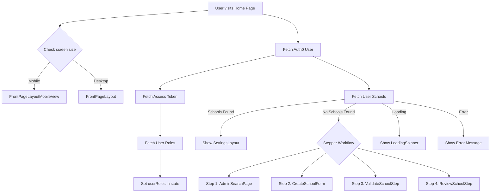

Home Page Overview

This file defines the main Home page of the application. It manages school-related workflows, user roles, and page layouts for both desktop and mobile users.

Key Responsibilities

Responsive Layout

Detects if the user is on mobile or desktop (isMobile state).

Renders FrontPageLayout (desktop) or FrontPageLayoutMobileView (mobile).

User Authentication & Roles

Uses Auth0 (useUser) to get the logged-in user.

Fetches an access token and retrieves user roles from the Auth0 Management API.

Stores roles in state (userRoles).

School Management

Fetches schools associated with the logged-in user.

Handles loading state (isLoading) and error messages (message).

If no schools are found, prompts user to create a new one.

Multi-Step Workflow (Stepper)
Guides users through creating and validating a school with 4 steps:

Search → AdminSearchPage

Create → CreateSchoolForm

Validate → ValidateSchoolStep

Complete → ReviewSchoolStep

Step navigation handled with Next/Back buttons.

UI updates dynamically to highlight the current step.

Conditional Rendering

If loading → show LoadingSpinner.

If no schools → show stepper workflow or AdminSearchPage.

If schools exist → show SettingsLayout.

Main Components Used

Layouts:
FrontPageLayout, FrontPageLayoutMobileView, SettingsLayout

School Workflow:
AdminSearchPage, CreateSchoolForm, ValidateSchoolStep, ReviewSchoolStep

Helpers/Utilities:
LoadingSpinner, Auth0 (useUser)

High-Level Flow

Detect user & device type.

Fetch user roles and associated schools.

If schools exist → show settings.

If not → walk user through the 4-step school creation workflow.

Display within mobile or desktop layout depending on screen size.

