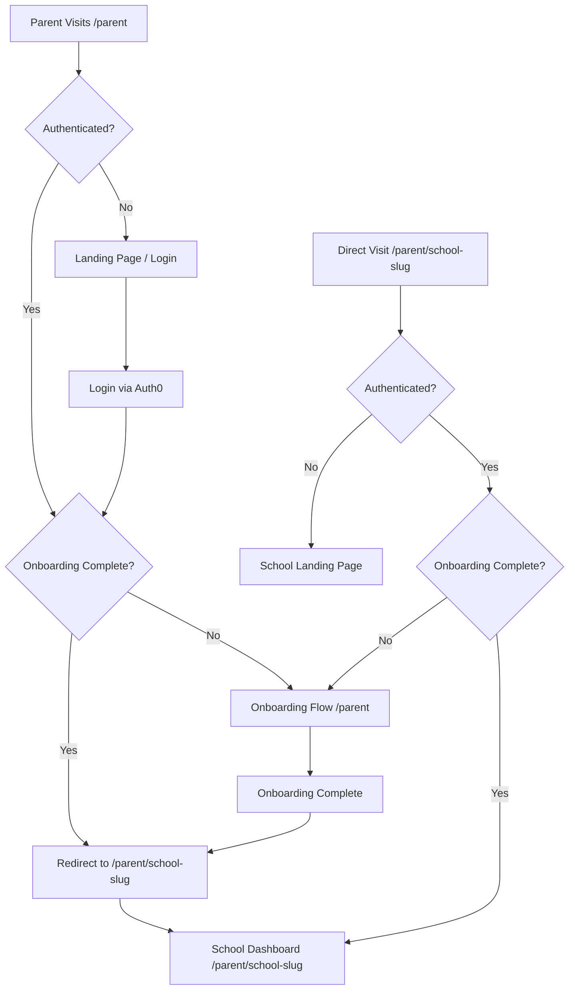

# Parent Portal Routing & SEO Strategy

This directory contains the parent portal pages, which have been restructured to optimize for SEO and provide a more personalized user experience through school-specific slugs.

## Overview

The platform uses a dynamic routing structure to provide each school with its own SEO-friendly URL. This allows search engines to index individual school pages and enables better visibility for top-performing schools.

### URL Structure

- `/parent`: Generic entry point. Redirects to login, handles onboarding, or redirects onboarded users to their school-specific slug. **No dashboard is rendered here.**
- `/parent/[school-slug]`: School-specific dashboard and landing page.

## User Flow

## SEO Optimization

1.  **Dynamic Slugs**: Each school has a unique URL (e.g., `/parent/greenwood-high-school`).
2.  **Meta Tags**: School-specific pages include dynamic titles and meta descriptions to improve search engine rankings.
3.  **Landing Pages**: Logged-out users visiting a school-specific URL see a customized landing page for that school, encouraging them to sign in.

## Technical Details

- **Slugification**: School names are converted to SEO-friendly slugs using the `slugify` utility in `lib/utils/slugify.ts`.
- **Filtering**: The school-specific dashboard (`/parent/[school_slug]/index.tsx`) automatically filters learners to only show those associated with the relevant school.
- **Redirection**:
    - The root `/parent` page automatically redirects authenticated parents with completed onboarding to their primary school's dashboard.
    - The onboarding flow redirects to the specific school dashboard upon successful completion.

## Components

- `pages/parent/index.tsx`: Main entry point, onboarding host, and redirect handler.
- `pages/parent/[school_slug]/index.tsx`: School-specific dashboard and landing page.
- `lib/utils/slugify.ts`: Helper for generating URL slugs.
