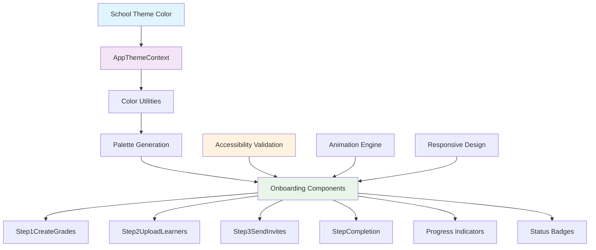
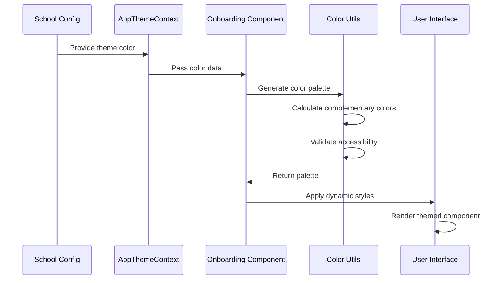
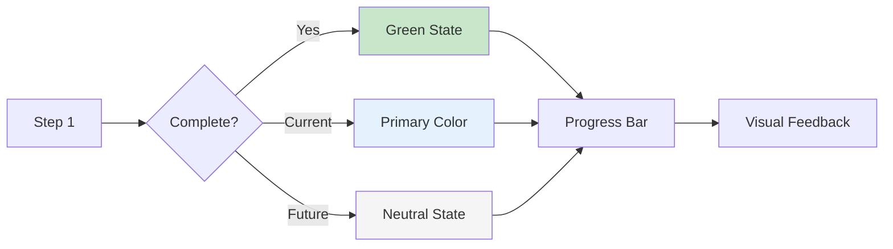
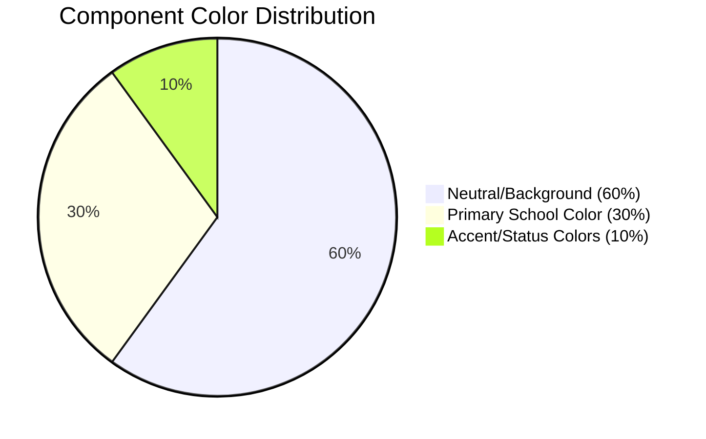
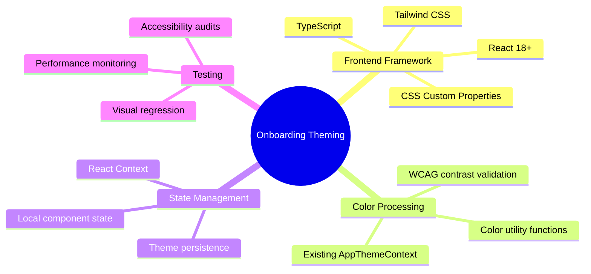
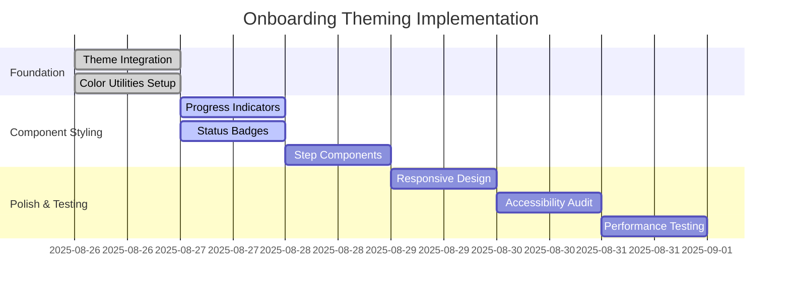
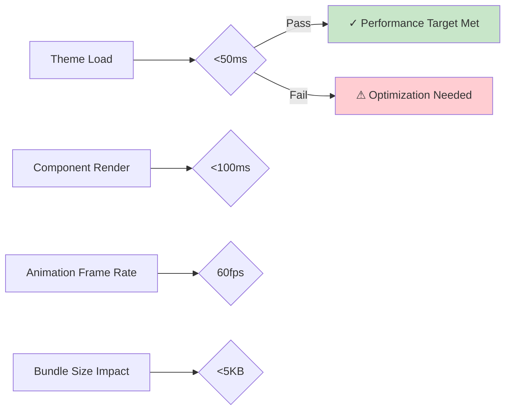
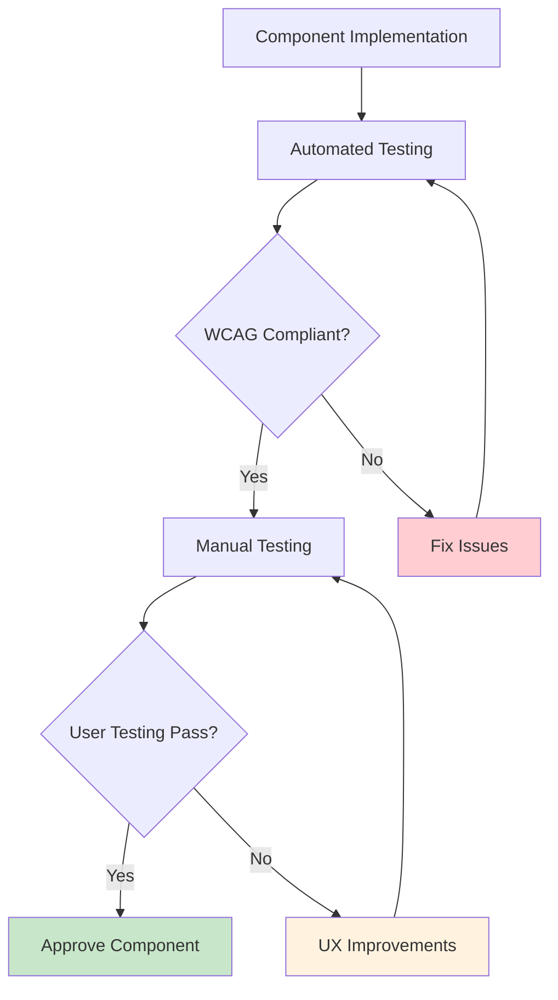
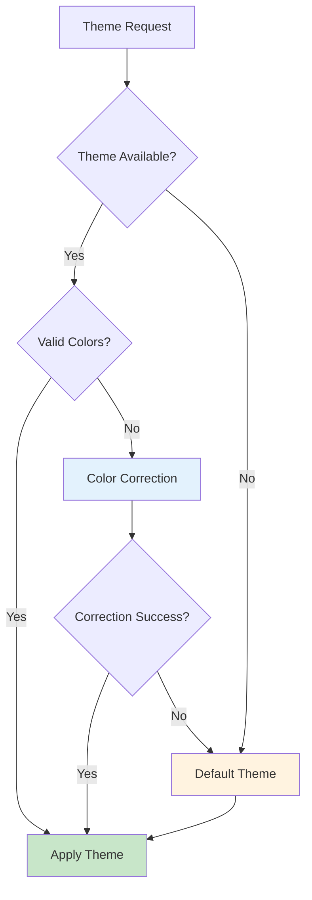

# Onboarding Status Component Theming - Overview

**Author:** Kagiso (Senior Developer)  
**Date:** August 26, 2025  
**Target Audience:** SchoolHeadOffice UI/UX Development Team  
**Repository:** SchoolHeadOffice_Invitations  
**Related:** [Main Onboarding Documentation](./README.md)

## Executive Summary

This document provides an overview of the dynamic theming implementation for onboarding status components in the SchoolHeadOffice application. The system enables automatic color adaptation based on school branding while maintaining accessibility standards and providing clear user progress indication throughout the onboarding flow.

## System Architecture Overview



## Component Architecture

The theming system follows a hierarchical approach where color information flows from the school configuration through the theme context to individual components:

### Data Flow Pattern



### Theme Processing Pipeline

The color processing occurs in several distinct phases:

#### 1. Color Input Validation
- Validates incoming theme colors from school configuration
- Implements fallback mechanisms for invalid or missing colors
- Provides default color schemes when theme data is unavailable

#### 2. Palette Generation
- Generates complementary and triadic color variations
- Creates appropriate text colors for optimal contrast
- Calculates status-specific colors (success, warning, error)

#### 3. Accessibility Compliance
- Ensures WCAG 2.1 AA compliance for all color combinations
- Automatically adjusts colors that fail contrast requirements
- Provides high contrast mode support

#### 4. Component Application
- Applies colors through CSS custom properties
- Manages interactive states (hover, focus, active)
- Handles responsive design considerations

## Component Specifications

### Core Components

#### Progress Indicator System


#### Status Badge Variants
- **Complete**: Success color (green variations)
- **In Progress**: Primary school color with opacity variations
- **Pending**: Neutral gray tones
- **Skipped**: Muted primary color with distinctive styling

#### Step Component Theming
Each step component receives consistent theming:
- Background colors following the 60-30-10 rule
- Interactive element styling with school colors
- Form field theming for consistency
- Error and success state management

## Design System Integration

### Color Distribution Strategy



### Typography and Spacing
- Consistent with existing SchoolHeadOffice design system
- 8px baseline spacing grid
- Major Third (1.25) typography scale
- Responsive font sizing with fluid transitions

### Animation Framework
- **Duration Standards**: 0.3s for color transitions, 0.5s for progress animations
- **Easing Functions**: ease-in-out for smooth color changes
- **Performance**: 60fps target for all animations
- **Accessibility**: Respects `prefers-reduced-motion` user preferences

## Implementation Architecture

### File Structure
```
components/onboarding/
├── OnboardingFlow/
│   ├── Step1CreateGrades.tsx      # Enhanced with theming
│   ├── Step2UploadLearners.tsx    # Enhanced with theming
│   ├── Step3SendInvites.tsx       # Enhanced with theming
│   └── StepCompletion.tsx         # Enhanced with theming
├── components/
│   ├── ProgressIndicator.tsx      # Dynamic color integration
│   └── StatusBadge.tsx           # Multi-variant theming
├── context/
│   └── ThemeContext.tsx          # Extended for onboarding
├── utils/
│   └── colorUtils.ts             # Enhanced utilities
└── styles/
    └── onboarding-theme.css      # CSS custom properties
```

### Technology Stack Integration



## Development Workflow

### Phase-Based Implementation



### Quality Assurance Strategy

#### Automated Testing
- **Accessibility**: Automated WCAG compliance checking
- **Performance**: Bundle size and runtime performance monitoring
- **Visual**: Automated screenshot comparison testing
- **Cross-browser**: Compatibility testing across major browsers

#### Manual Testing
- **User Experience**: Navigation flow and interaction testing
- **Visual Quality**: Design consistency and aesthetic evaluation
- **Accessibility**: Screen reader and keyboard navigation testing
- **Responsive**: Multi-device and orientation testing

## Performance Considerations

### Optimization Strategies
- **Color Calculation Memoization**: Cache generated palettes to prevent recalculation
- **CSS Custom Properties**: Enable runtime theming without JavaScript recalculation
- **Progressive Enhancement**: Core functionality works without themes
- **Selective Re-rendering**: Only update components when theme actually changes

### Performance Metrics


## Accessibility Framework

### WCAG 2.1 Compliance Standards
- **Color Contrast**: Minimum 4.5:1 ratio for normal text, 3:1 for large text
- **Alternative Indicators**: Progress indication beyond color alone
- **Keyboard Navigation**: Full functionality accessible via keyboard
- **Screen Reader Support**: Proper ARIA labels and state announcements

### Accessibility Testing Pipeline


## Error Handling & Fallbacks

### Robust Error Management
- **Missing Theme Data**: Graceful degradation to default colors
- **Invalid Colors**: Automatic color correction and validation
- **Context Failures**: Component-level error boundaries
- **Performance Issues**: Progressive enhancement with fallbacks

### Fallback Strategy


## Success Metrics & KPIs

### Technical Metrics
- **Accessibility Score**: Target ≥95% (Lighthouse audit)
- **Performance Impact**: <5% bundle size increase
- **Color Consistency**: 100% visual regression test pass rate
- **Cross-browser Compatibility**: 100% feature parity across supported browsers

### User Experience Metrics
- **Task Completion Rate**: Improved onboarding flow completion
- **User Engagement**: Increased interaction with onboarding elements
- **Brand Recognition**: Consistent school branding throughout flow
- **Accessibility Usage**: Screen reader and keyboard user feedback

### Development Metrics
- **Code Quality**: >90% code review approval rate
- **Implementation Speed**: 2-day delivery target
- **Maintenance Overhead**: <10% additional development time for theme updates
- **Developer Experience**: Positive team feedback on implementation patterns

## Integration Patterns

### Theme Context Integration
```typescript
// Component integration pattern
const OnboardingComponent = () => {
  const { primaryColor, getPrimaryColorValue } = useAppTheme();
  const colorPalette = generateColorPalette(getPrimaryColorValue());
  
  return (
    <div 
      style={{
        '--primary-color': colorPalette.primary,
        '--secondary-color': colorPalette.secondary,
        '--text-color': colorPalette.logo
      } as React.CSSProperties}
      className="themed-component"
    >
      {/* Component content */}
    </div>
  );
};
```

### CSS Custom Property Usage
```css
.themed-component {
  background-color: var(--primary-color);
  color: var(--text-color);
  border-color: var(--secondary-color);
  transition: all 0.3s ease-in-out;
}

.themed-component:hover {
  background-color: var(--secondary-color);
  transform: scale(1.02);
}
```

## Future Enhancements

### Planned Improvements
- **Advanced Color Harmonies**: Tetradic and split-complementary schemes
- **Seasonal Theming**: Time-based color adaptations
- **User Preferences**: Individual user theme customization
- **Animation Presets**: School-specific animation styles
- **Dark Mode Support**: Automatic light/dark mode switching

### Scalability Considerations
- **Multi-tenant Support**: Efficient theme switching between schools
- **Performance Optimization**: Advanced caching and lazy loading
- **Component Library**: Reusable themed components across platform
- **Theme Management**: Administrative interface for theme customization

## Risk Assessment

### Technical Risks
| Risk | Probability | Impact | Mitigation |
|------|-------------|--------|------------|
| Accessibility violations | Medium | High | Automated compliance testing |
| Performance degradation | Low | Medium | Performance budgets and monitoring |
| Browser compatibility | Low | Medium | Progressive enhancement approach |
| Color contrast issues | Medium | High | Automated contrast validation |

### Mitigation Strategies
- Comprehensive automated testing pipeline
- Progressive enhancement with graceful degradation
- Performance monitoring and budget enforcement
- Regular accessibility audits and user testing

## Documentation & Support

### Developer Resources
- **Implementation Guide**: Step-by-step component theming instructions
- **API Reference**: Complete interface documentation for theme utilities
- **Design Guidelines**: Visual standards and component specifications
- **Troubleshooting Guide**: Common issues and resolution strategies

### Maintenance & Updates
- **Version Control**: Semantic versioning for theme system updates
- **Migration Guides**: Instructions for updating existing components
- **Change Log**: Detailed documentation of system modifications
- **Support Channels**: Developer assistance and feedback collection

---

*This overview provides the foundational understanding needed to implement and maintain the onboarding component theming system. For detailed implementation instructions and specific component guidelines, refer to the accompanying technical documentation and component-specific guides.*